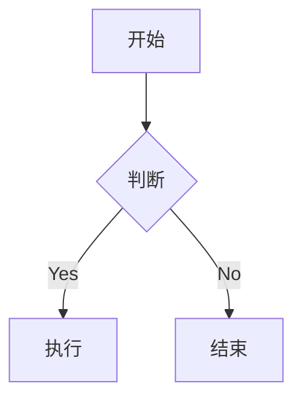

# 标题示例

## 链接示例
[外部链接](https://example.com)
[内部链接](/posts/another)

## 图片示例

## 数学公式
$$
f(x) = \int_{-\infty}^{\infty} \hat{f}(\xi) e^{2 \pi i \xi x} d\xi
$$

## 流程图

## 脚注示例
这是一个脚注[^1]

[^1]: 脚注内容
