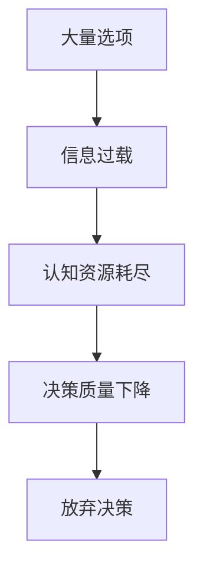

+++
title = '营销'
date = '2024-12-29T09:31:37+08:00'
draft = true
tags = ["营销"]
categories= ["营销"]
description = "决策瘫痪"
toc = true
+++
# 决策瘫痪：选择太多反而寸步难行

## 现象解析

当面对过多选择时，人们会:
1. 耗费过多精力对比选项
2. 担心做出错误决策
3. 因认知负荷过重而放弃选择
4. 即使做出选择也会感到不确定和焦虑

## 科学依据

### 果酱实验深度剖析
- 实验设计：
  - A组：6种果酱，简单决策场景
  - B组：24种果酱，复杂决策场景

- 关键数据：
  - A组购买率：30%
  - B组购买率：3%
  - 差距达10倍

- 认知机制：


### 神经科学解释
1. 工作记忆负荷
   - 人脑同时只能处理5-9个信息单元
   - 超出容量会触发认知疲劳
   - 降低决策效率

2. 决策成本计算
   - 大脑会权衡决策收益与认知成本
   - 当成本过高时选择放弃
   - 保护认知资源

## 实践应用

### 餐厅菜单优化
1. 分类展示
   - 将菜品按类别清晰分组
   - 每类控制在5-7个选项
   - 突出特色推荐菜品

2. 信息层级
   - 核心信息：菜名、价格
   - 次要信息：配料、口味
   - 辅助信息：图片、推荐度

3. 推荐策略
```python
def optimize_menu():
    # 减少选项数量
    limit_options_per_category(7)
    # 突出特色菜品
    highlight_signature_dishes()
    # 简化描述
    simplify_descriptions()
```

### 电商产品展示
1. 筛选机制
   - 提供精准筛选条件
   - 默认显示最相关选项
   - 支持多维度排序

2. 展示策略
   - 首页限展20个商品
   - 相似商品合并展示
   - 突出差异化特征

## 解决方案

### 商家视角
1. 精简选项
   - 剔除重复性选项
   - 保留特色产品
   - 突出核心竞争力

2. 引导决策
   - 设置默认推荐
   - 提供选择建议
   - 简化决策流程

### 消费者视角
1. 决策简化
   - 设定决策标准
   - 限定对比维度
   - 控制选择时间

2. 情绪管理
   - 接受"满意"选择
   - 避免追求"最优"
   - 降低决策压力

## 最佳实践

### 产品设计指南
```javascript
// 选项数量控制
const OPTIMAL_OPTIONS = {
  initial_display: 7,  // 首屏展示
  max_per_category: 12,  // 分类上限
  featured_items: 3   // 推荐数量
};

// 信息展示策略
function displayStrategy(items) {
  return items
    .slice(0, OPTIMAL_OPTIONS.initial_display)
    .map(item => ({
      primary: item.name,
      secondary: item.price,
      details: item.description
    }));
}
```

### 效果评估
1. 转化指标
   - 决策时长
   - 选择率
   - 满意度
   - 复购率

2. 用户体验
   - 决策压力
   - 选择信心
   - 后悔程度

总之，在设计选择系统时，需要在丰富性和简单性之间找到平衡点，既满足用户多样化需求，又不至于造成决策瘫痪。关键是理解用户认知负荷的限制，通过合理的信息架构和交互设计，让决策过程更轻松自然。
