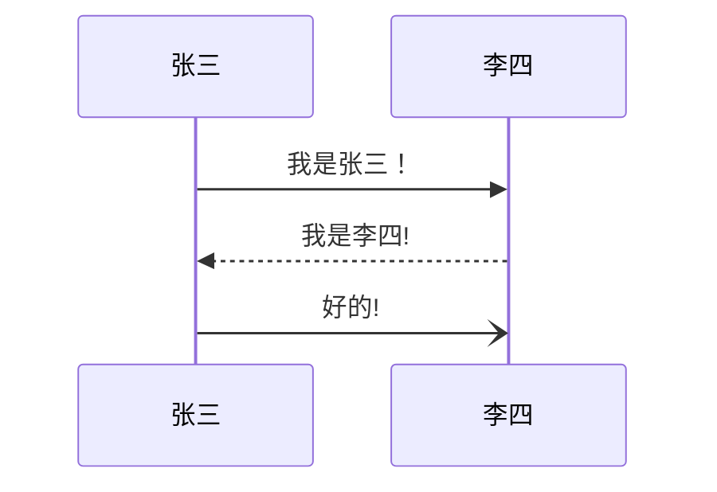
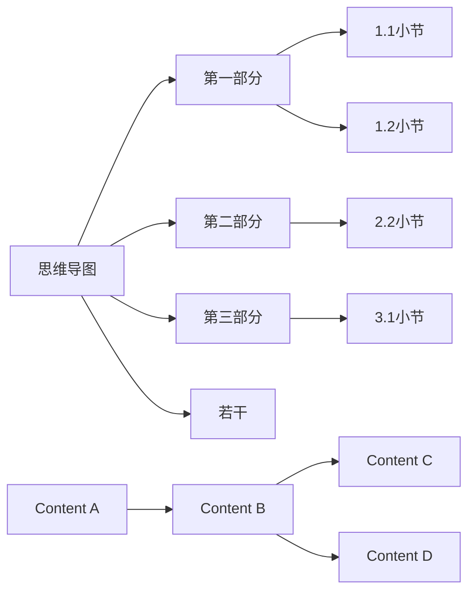
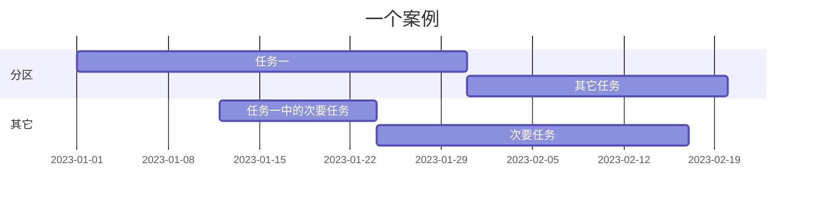
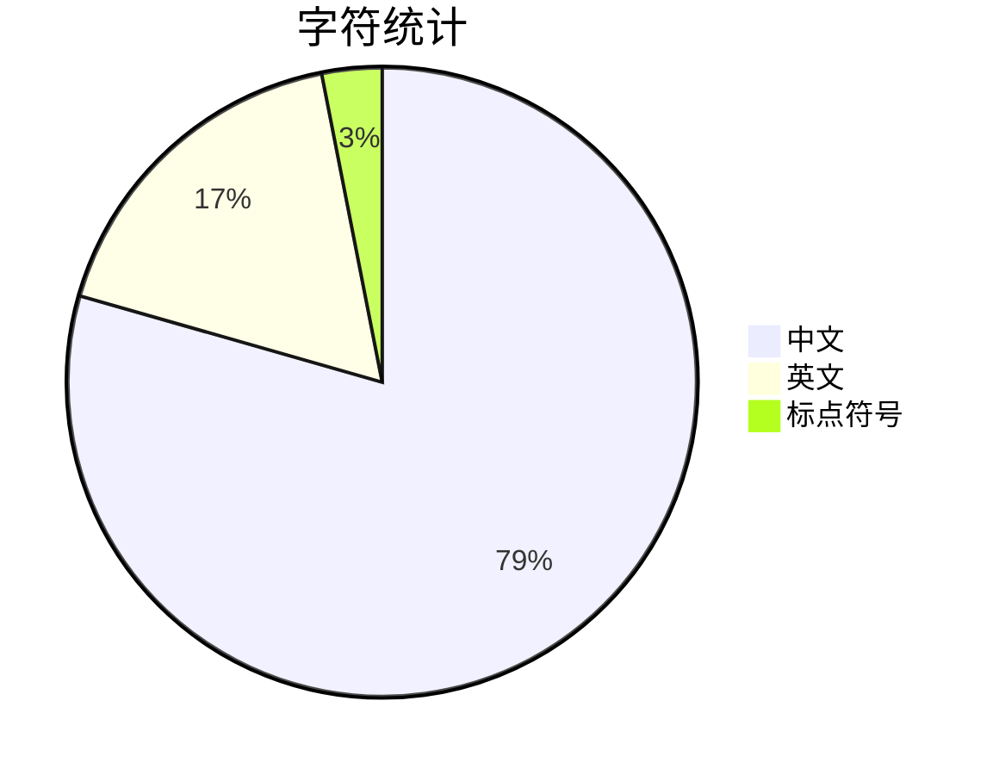

+++
title = 'mermaid？'
date = 2025-03-14T14:51:51+08:00
draft = false
author = "simons"
categories = ["营销"]
tags = ["经典案例"]
description = "test"
+++

mermaid可以在主流的markdown工具中使用
下面是几个常用的图示类型

#### 1.思维导图

   - 空格敏感

   ```mermaid
   mindmap
     root((思维导图))
       节点一
         记录1.1
         ::icon(fa fa-book)
         节点1.1
           记录1.1.1
       节点二
         记录2.1
         记录2.2
           节点2.1
               记录2.1.1
         			记录2.1.2
             	记录2.1.3
       节点三
         记录3.1
         记录3.2
   ```


   - 基础

   - 语法

     - 形状

       - 默认

         ```mermaid
         mindmap
             I am the default shape
         ```


       - `[]`矩形

         ```mermaid
         mindmap
             id[I am a square]
         ```

       - 圆角矩形

         ```mermaid
         mindmap
             id(I am a rounded square)
         ```


       - 圆形

         ```mermaid
         mindmap
             id((I am a circle))
         ```


       - 爆炸形

         ```mermaid
         mindmap
             id))I am a bang((
         ```


       - 云朵形

         ```mermaid
         mindmap
             id)I am a cloud(
         ```


       - 六边形

         ```mermaid
         mindmap
             id{{I am a hexagon}}
         ```


     - `::icon()`图标

       ```mermaid
       mindmap
           Root
               A
               ::icon(fa fa-book)
               B(B)
               ::icon(fa fa-car)
       ```


     - 级别

       ```mermaid
       mindmap
           Root
               A[A]
               :::urgent large
               B(B)
               C
       ```


     - markdown字符串

       ```mermaid
       mindmap
           id1["**Root** with
       a second line
       Unicode works too: 🤓"]
             id2["`The dog in **the** hog... a *very long text* that wraps to a new line`"]
             id3[Regular labels still works]
       ```


     - 翻动

     - 翻动

   - 语法

   - 语法


#### 2. 顺序图




- 基础

- 语法

  - `actor 名称`象形图形

  ```mermaid
  sequenceDiagram
      actor 张三
      actor 李四
      张三->>李四: 你好，李四，我是张三！
      李四->>张三: 你好，张三！
  ```

  - `participant A as A的别名` 使用别名

    ```mermaid
    sequenceDiagram
        participant Z as 张三
        participant L as 李四
        Z->>L: 你好，李四！
        L->>Z: 你好!
    ```

  - 使用盒子分组

    ```markdown
    box 组名

    box 颜色 组名
    participant 马克
    participant B as 杰森                  可以使用as取别名
    end


    box Group without description
    ... actors ...
    end
    box 指定颜色
    box rgb(33,66,99)
    ... actors ...
    end
    box 指定透明
    box transparent Aqua
    ... actors ...
    end
    ```

    - 盒子（分组）

      ```mermaid
      sequenceDiagram
          box rgb(255,34,67) 场景组
          participant A as 马克
          participant B as 杰森
          end
          box orange 后期组
          participant C as 泰克
          end

          box white 道具组
          participant  D as 斯坦
          end

          box lightblue演员组
          participant 瓦特
          participant E as 托尼
          end

          box transparent 导演组
          participant F as 塔克
          end

          A->>B: 不错
          B->>E: 演员呢
          A->>D: 换道具了
          B->>C: 后期组在吗?
          A->>F: 我是马克
          F->>D: 我是塔克
          E->>F: 我是托尼
          瓦特->>F: 这里是演员组

      ```

  - 可以使用的箭头

    | 类型   | 描述                         |
    | :----- | :--------------------------- |
    | `->`   | 没有箭头的实线               |
    | `-->`  | 没有箭头的虚线               |
    | `->>`  | 带箭头的实线                 |
    | `-->>` | 带箭头的虚线                 |
    | `-x`   | 末尾有十字的实线             |
    | `--x`  | 末端有十字的虚线。           |
    | `-)`   | 尾端有开箭头的实线（异步）   |
    | `--)`  | 末端有开放箭头的虚线（异步） |

  - `deactivate`保持对象（`activate`激活对象）

    -  通常用于表示一个完整的内容，避免分割造成的歧义

    ```mermaid
    sequenceDiagram
        张三->>李四: 我是可以使用的对象
        activate 李四
        李四-->>张三: Great!
        deactivate 李四
        张三->>李四: 刚才被停用了
        李四-->>张三: Great!
        activate 李四
        李四-->>张三: Great!
    ```

    - 快捷方式：在消息箭头上附加+/-后缀 `->>+`  `-->>-`

    ```mermaid
    sequenceDiagram
        张三->>+李四: Hello John, how are you?
        李四-->>-张三: Great!
    ```

    - 堆叠

      ```mermaid
      sequenceDiagram
          张三->>+李四: Hello John, how are you?
          张三->>+李四: John, can you hear me?
          李四-->>-张三: Hi Alice, I can hear you!
          李四-->>-张三: I feel great!
      ```

    - 注释

      ```mermaid
      sequenceDiagram
          participant 李四
          Note right of 李四: 这是注释
      ```

      - 跨对象注释

        ```mermaid
        sequenceDiagram
            张三->>李四: 你好，李四
            Note over 张三,李四: 这是注释
        ```

      - 注释使用换行符

        ```mermaid
        sequenceDiagram
            张三->>李四: 你好
            Note over 张三,李四: 尖括号内使用br斜杠<br/>换行
        ```

    - 循环

      ```markdown
    loop 循环说明
      	循环内容
      end
      ```


      ```mermaid
    sequenceDiagram
          张三->李四: 接下来是一个循环
          loop 循环的说明
              李四-->张三: 循环的内容
          end
      ```


    - 替换和选择

      ```markdown
    可以在序列图中表达替代路径。

      alt 描述信息
      ... statements ...
      else
      ... statements ...
      end

      或者

      如果有可选的序列（如果没有其他）

      opt 描述信息
      ... statements ...
      end
      ```


      ```mermaid
    sequenceDiagram
          张三->>李四: 怎么样
          alt 生病了
              李四->>张三: 不太好:(
          else 健康
              李四->>张三: 很好
          end
          opt 额外的
              李四->>张三: 谢谢关心
          end
      ```

    - 并行发生

      ```markdown
    可以显示并行发生的行为。

      par [Action 1]
      ... statements ...
      and [Action 2]
      ... statements ...
      and [Action N]
      ... statements ...
      end
      ```


      ```mermaid
    sequenceDiagram
          par 张三 to 李四
              张三->>李四: 你好
          and 张三 to 王五
              张三->>王五: 你好
          end
          李四-->>张三: 你好，张三
          王五-->>张三: 你好，张三
      ```

      - 嵌套平行块

        ```mermaid
        sequenceDiagram
            par 张三 to 李四
                张三->>李四: Go help John
            and 张三 to 王五
                张三->>王五: I want this done today
                par 王五 to 赵六
                    王五->>赵六: Can we do this today?
                and 王五 to 小明
                    王五->>小明: Can you help us today?
                end
            end
        ```


    - 条件触发

      ```markdown
    可以显示必须通过有条件处理情况自动发生的操作。
      critical [Action that must be performed]
      ... statements ...
      option [Circumstance A]
      ... statements ...
      option [Circumstance B]
      ... statements ...
      end
      ```

      ```mermaid
    sequenceDiagram
          critical 拨打电话给李四
              张三-->李四: 打电话
          option 话费不足
              张三-->张三: 通话失败
          option 被拒绝
              张三-->张三: 再次通话失败
          end
      ```

      ```mermaid
    sequenceDiagram
          critical 张三打电话给李四
              张三-->李四: 成功
          end
      ```


    - 中断

      ```markdown
    可以指示流中序列的停止（通常用于模拟异常）。

      break [something happened]
      ... statements ...
      end
      ```

      ```mermaid
    sequenceDiagram
          消费者-->商家: 买一个笔记本
          商家-->仓库: 查仓库的库存
          break 无库存
              商家-->消费者: 提示无库存
          end
          商家-->财务系统: 财务登记
      ```


    - 背景高亮显示

      ```markdown
    可以通过提供彩色背景来突出显示流。
      颜色是使用rgb和rgba语法定义的。

      rect rgb(0, 255, 0)
      ... content ...
      end
      rect rgba(0, 0, 255, .1)
      ... content ...
      end
      ```

      ```mermaid
    sequenceDiagram
          participant Alice as 张三
          participant John as 李四

          rect rgb(191, 223, 255)
          note right of Alice: 张三给李四打电话
          Alice->>+John: 你好，李四！
          rect rgb(200, 150, 255)
          Alice->>+John: 李四，你能听到我说话吗？
          John-->>-Alice: 我可以听到
          end
          John-->>-Alice: 很清晰
          end
          Alice ->>+ John: 今晚有空看比赛吗？
          John -->>- Alice: 可以的！
      ```


    - `%%注释内容`，换行结束注释

      ```mermaid
    sequenceDiagram
          A->>J: Hello J, how are you?
          %% this is a comment
          J-->>A: Great!
      ```

    - 转义字符

      ```mermaid
    sequenceDiagram
          A->>B: I #9829; you!
          B->>A: I #9829; you #infin; times more!
      ```


    - 翻动分

    -  赛

    - 翻动

  - 语法

- 扽色

- 冬粉

  - 使用`end`时，建议用`[] 或 {} 或 ()`括起来

#### 3. 流程图`flowchart`

- 使用`graph`也可以

- 基础：
  - 节点：箭头（连接线）指向的图形
  - 内容：节点上的文字
  - 对空格不敏感
  - `---`三个减号表示线，最后一个减号改为`>`可带箭头，增加`-`可增加长度

````markdown
	```mermaid
	graph LR
	思维导图--> 第一部分
	第一部分-->1.1小节
	第一部分-->1.2小节

	思维导图--> 第二部分
	第二部分-->2.2小节

	思维导图--> 第三部分
	第三部分--> 3.1小节
	思维导图--> 若干
```
````



- 语法：

  - 排列方式

    - `graph LR` 从左到右排列，RL相反
    - `graph BT` 从上到下排列，TB相反

  - 连接方式

    - `-->` 箭头连接

      ```mermaid
      graph LR
      A --> B
      ```


    - `---` 无箭头连接

      ```mermaid
      graph LR
      A---B
      ```


    - `--连接线上带文字---` 或 `C---|连接线上带文字|D`连接线上带文字

      ```mermaid
      graph LR
      A-- 连接上的文字 ---B
      C---|连接线上带文字|D
      ```


    - `-->箭头连接线上带文字---` 或 `C--->|箭头连接线上带文字|D`箭头连接线上带文字

      ```mermaid
      graph LR
      A--> 连接上的文字 -->B
      C--->|连接线上带文字|D
      ```


    - `A-.->B`虚线连接

      ```mermaid
      graph LR
         A-.->B
      ```

    - `A-.带文字的虚线连接.->B`带文字的虚线连接

      ```mermaid
      graph LR
      A-.带文字的虚线连接.->B
      ```


    - `A==>B`粗连接

      ```mermaid
      graph LR
      A==>B
      ```


    - `A == 带文本的粗连接 ==> B `带文本的粗连接


      ```mermaid
      graph LR
      A == 带文本的粗连接 ==> B
      ```

    -

    - 特殊字符的显示

      ```mermaid
       graph LR
      A["这里有个引号#quot;"] -->B["特殊字符:#9829;"]
      ```

    - 破坏语法的字符`!`


      ```mermaid
      graph LR
      A["破坏语法的特殊字符 ! "]
      ```


  - 节点形状

    - `A(圆角矩形)` “A”和“圆角矩形”可以是任意字符

      ```mermaid
      graph RL
      A(圆角矩形)
      ```

    - A[矩形]

      ```mermaid
      graph RL
      A[矩形]
      ```


    - A((圆形))

      ```mermaid
      graph RL
      A((圆形))
      ```


    - A>非对称形状]

      ```mermaid
      graph RL
      A>非对称形状]
      ```


    - A{菱形}

      ```mermaid
      graph RL
      A{菱形}
      ```


  - 文字（别名）

    - `start[开始]`start将作为节点，显示的字符为开始

  - 子图

    ```markdown
    	subgraph 图像块标题1
    	图像快中的连接
    	subgraph 图像块标题2
    	图像快中的连接
    	......
      end
    ```

    ```mermaid
    graph TB
        c1-->a2
        subgraph one
        a1-->a2
        end
        subgraph two
        b1-->b2

        end
        subgraph three
        c1-->c2
        end
    ```

  - 带样式的连接

    - 参数
      - `fill`：内部填充色
      - `stroke`：描边颜色
      - `stroke-width`：描边宽度
      - `stroke-dasharray`: 虚线描边（虚线块的宽度  虚线空格的宽度）

    ```mermaid
    graph LR
        A(Start)-->B(Stop)
        style A fill:#f9f,stroke:#333,stroke-width:4px
        style B fill:#ccf,stroke:#f66,stroke-width:2px,stroke-dasharray: 5 5

         style C fill:#f9f,stroke:#993,stroke-width:4px
         style D fill:#ccf,stroke:#f6f6,stroke-width:6px,stroke-dasharray: 4 2
    ```

- 对[fontawesome](https://fontawesome.com.cn/v5)的基本支持
  - 图标通过语法`"fa:图标名称"`来获取

    ```mermaid
    graph TD
        B["fa:fa-twitter 和平"]
        B-->C[fa:fa-ban 禁止]
        B-->D(fa:fa-spinner);
        B-->E(fa:fa-camera-retro 也许?);
        E-->F(fa:fa-car 汽车)
        B-->G(fa:fa-file 文件)
    ```


  - fds

  - fdsfsd

#### 4. 甘特图




> 甘特图将把每个计划的任务记录为一个从左向右延伸的连续条。x轴表示时间，y记录不同的任务和完成它们的顺序。
>
> 重要的是要记住，当特定于任务的日期、日期或日期集合被“排除”时，甘特图将通过向右延长相等的天数来适应这些变化，而不是在任务内部创建空隙。但是，如果排除的日期在设置为连续开始的两个任务之间，则排除的日期将以图形方式跳过并留空，以下任务将在排除日期结束后开始。
>
> 甘特图可用于跟踪项目完成所需的时间，但它也可以用于以图形方式表示“非工作日”，只需进行一些调整。

1. 语法

   1. ```mermaid
      gantt
          dateFormat  YYYY-MM-DD
          title       Adding GANTT diagram functionality to mermaid
          excludes    weekends
          %% (`excludes` accepts specific dates in YYYY-MM-DD format, days of the week ("sunday") or "weekends", but not the word "weekdays".)

          section A section
          Completed task            :done,    des1, 2023-01-06,2023-01-08
          Active task               :active,  des2, 2023-01-09, 3d
          Future task               :         des3, after des2, 5d
          Future task2              :         des4, after des3, 5d

          section Critical tasks
          Completed task in the critical line :crit, done, 2023-01-06,24h
          Implement parser and jison          :crit, done, after des1, 2d
          Create tests for parser             :crit, active, 3d
          Future task in critical line        :crit, 5d
          Create tests for renderer           :2d
          Add to mermaid                      :1d
          Functionality added                 :milestone, 2023-01-25, 0d

          section Documentation
          Describe gantt syntax               :active, a1, after des1, 3d
          Add gantt diagram to demo page      :after a1  , 20h
          Add another diagram to demo page    :doc1, after a1  , 48h

          section Last section
          Describe gantt syntax               :after doc1, 3d
          Add gantt diagram to demo page      :20h
          Add another diagram to demo page    :48h
      ```

   2. 由多个空间分割的依赖项

      ```mermaid
      gantt
          apple :a, 2023-07-20, 1w
          banana :crit, b, 2023-07-23, 1d
          cherry :active, c, after b a, 1d
      ```


   3. `title`标题

      - `title`是一个*可选*字符串，显示在甘特图表的顶部，以描述整个图表。


   4. `section`章节声明

      - 将图标分为多个部分

   5. `milestone`重要事件

      - 代表时间上的单个瞬间

      - 里程碑的确切位置由里程碑的初始日期和任务的“持续时间”决定：*初始日期*+*持续时间*/2。

        ```mermaid
        gantt
            dateFormat HH:mm
            axisFormat %H:%M
            Initial milestone : milestone, m1, 17:49, 2m
            Task A : 10m
            Task B : 5m
            Final milestone : milestone, m2, 18:08, 4m
        ```


   6. 日期

      - `dateFormat`定义甘特元素的日期输入格式。这些日期如何在渲染的图表输出中表示，由`axisFormat`定义。

      - 日期格式`dateFormat YYYY-MM-DD`

      - | 输入的信息 | 示例：         | 描述                                         |
        | :--------- | :------------- | :------------------------------------------- |
        | `YYYY`     | 2014 年        | 4位数年                                      |
        | `YY`       | 14             | 2位数年                                      |
        | `Q`        | 1..4           | 一年的四分之一。将月份设置为季度的第一个月。 |
        | `M MM`     | 1..12          | 月号                                         |
        | `MMM MMMM` | 一月..十二月   | 区域设置中的月份名称由`dayjs.locale()`       |
        | `D DD`     | 1..31          | 月日                                         |
        | `Do`       | 第1..31        | 带有序数的月日                               |
        | `DDD DDDD` | 1..365         | 一年中的一天                                 |
        | `X`        | 1410715640.579 | Unix时间戳                                   |
        | `x`        | 1410715640579  | Unix ms时间戳                                |
        | `H HH`     | 0..23          | 24小时时间                                   |
        | `h hh`     | 1..12          | 12 hour time used with `a A`.                |
        | `a A`      | 下午上午       | 帖子或ante meridiem                          |
        | `m mm`     | 0..59          | 备忘录                                       |
        | `s ss`     | 0..59          | 秒                                           |
        | `S`        | 0..9           | 十分之一秒                                   |
        | `SS`       | 0..99          | 数百秒                                       |
        | `SSS`      | 0..999         | 千分之一秒                                   |
        | `Z ZZ`     | +12:00         | 从UTC偏移为+-HH:mm、+-HHmm或Z                |

      - 轴上的日期格式

        - 默认输出日期格式是`YYYY-MM-DD`。您可以定义自定义`axisFormat`，例如2020年第一季度的`2020-Q1`。

        - `axisFormat %Y-%m-%d`

        - | 格式 | 定义                                                    |
          | :--- | :------------------------------------------------------ |
          | %a   | 缩写的工作日名称                                        |
          | %A   | 完整的工作日名称                                        |
          | %b   | 缩写的月名                                              |
          | %B   | 完整月份名称                                            |
          | %c   | 日期和时间，如“%a %b %e %H:%M:%S %Y”                    |
          | %d   | 每月零填充日作为十进制数[01,31]                         |
          | %e   | 每月用空格填充的十进制数[1,31]；相当于%_d               |
          | %H   | 小时（24小时时钟）作为十进制数[00,23]                   |
          | %I   | 小时（12小时时钟）作为小数[01,12]                       |
          | %j   | 一年中的一天作为十进制数[001,366]                       |
          | %m   | 月份作为十进制数[01,12]                                 |
          | %M   | 分钟作为十进制数[00,59]                                 |
          | %升  | 毫秒作为十进制数[000,999]                               |
          | %p   | 上午或下午                                              |
          | %S   | 第二个十进制数[00,61]                                   |
          | %U   | 一年中的周数（周日作为一周的第一天）作为十进制数[00,53] |
          | %w   | 工作日作为十进制数[0（周日），6]                        |
          | %W   | 一年中的周数（周一作为一周的第一天）作为十进制数[00,53] |
          | %x   | 日期，如“%m/%d/%Y”                                      |
          | %X   | 时间，如“%H:%M:%S”                                      |
          | %y   | 没有世纪的年份作为十进制数[00,99]                       |
          | %Y   | 以世纪为十进制数的年份                                  |
          | %Z   | 时区偏移，例如“-0700”                                   |
          | %%   | 字面上的“%”字符                                         |


   7. 轴刻度

      1. 默认输出刻度是自动的。您可以自定义您的`tickInterval`，如`1day`或`1week`
      2. `tickInterval 1day`
      3. 模式：`/^([1-9][0-9]*)(minute|hour|day|week|month)$/;`

   8. 紧凑模式输出

      1. ```mermaid
         ---
         displayMode: compact
         ---
         gantt
             title A Gantt Diagram
             dateFormat  YYYY-MM-DD

             section Section
             A task           :a1, 2023-01-01, 30d
             Another task     :a2, 2023-01-20, 25d
             Another one      :a3, 2023-02-10, 20d
         ```

      2.

   9. ·`%%`注释

   10. fds

   11. fds

2.

#### 5. 饼图




> 饼图（或圆图）是一种圆形统计图形，分为切片以说明数字比例。在饼图中，每个切片的弧长（以及其中心角度和面积）与它所代表的数量成正比。

1. 语法

   1. `pie`关键字

   2. `showData`在图例文本之后呈现实际数据值。这是***可选的***
   3. 后面跟着`title`关键字及其在字符串中的值，以给饼图一个标题。这是***可选的***
   4. 其次是数据集。饼图将按照与标签相同的顺序顺时针排序。
   5. `label`在`" "`引号中的饼图中的一部分。
   6. 其次是`:`冒号作为分隔符
   7. 后跟`positive numeric value`（最多支持小数点后两位）
   8. ```mermaid
      %%{init: {"pie": {"textPosition": 0.5}, "themeVariables": {"pieOuterStrokeWidth": "5px"}} }%%
      pie showData
          title 软件技能
          "PS" : 42.96
          "Word" : 50.05
          "Exl" : 10.01
          "Ppt" :  5
      ```
   9.
   10. | 参数           | 描述                                             | 默认值 |
       | :------------- | :----------------------------------------------- | :----- |
       | `textPosition` | 馅饼片标签的轴向位置，从中心0.0到圆圈外缘的1.0。 | `0.75` |
