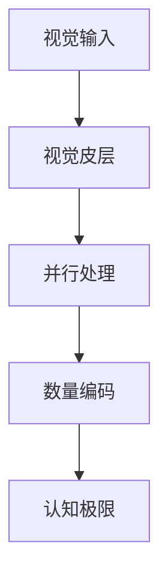

+++
title = 'File_name'
date = 2025-01-25T05:35:27+08:00
draft = true
author = "simons"
categories = ["暂无"]
tags = ["暂无"]
description = "糟糕，写文章的时候忘记添加描述了！！！"
+++

# 人类认知极限：一瞥之间的五个界限

## 科学发现

### 数字识别极限
```python
class VisualCognition:
    MAX_INSTANT_RECOGNITION = 5  # 最大瞬时识别数量
    PROCESSING_TIME_MS = 200     # 大脑处理时间(毫秒)
```

### 实验证据
1. **Kaufman实验(1949)**
   - 向受试者闪现不同数量点阵
   - 显示时间：50毫秒
   - 结果：4-5个点能准确报数
   - 超过5个需要计数

2. **Miller's Law(1956)**
   - 工作记忆容量：7±2项
   - 瞬时识别：5项以内
   - 证实了"神奇数字5"

## 认知机制

### 大脑工作原理


1. **并行处理阶段**
   - 5个以内：整体感知
   - 超过5个：需要序列扫描
   - 处理速度显著下降

2. **神经网络负载**
   - 前顶叶皮层活跃
   - 工作记忆容量受限
   - 注意力资源有限

## 实践启示

### 界面设计原则
1. **导航菜单**
   - 一级菜单≤5项
   - 使用分组和层级
   - 视觉区分度高

2. **信息展示**
```javascript
const UIGuidelines = {
    maxPrimaryOptions: 5,
    groupThreshold: 3,
    visualHierarchy: true
};
```

### 产品优化
1. **选项呈现**
   - 核心功能≤5个
   - 其余折叠或分页
   - 突出重点选项

2. **认知负荷控制**
   - 关键决策简化
   - 分步引导
   - 避免信息过载

## 应用场景

### 教育培训
1. **知识点分组**
   - 每组不超过5个
   - 循序渐进
   - 及时复习巩固

2. **记忆方法**
```python
def memory_chunking(items):
    """
    将信息分组便于记忆
    """
    chunks = []
    for i in range(0, len(items), 5):
        chunks.append(items[i:i+5])
    return chunks
```

### 商业应用
1. **产品陈列**
   - 核心产品≤5个
   - 分类展示
   - 突出差异

2. **决策优化**
   - 简化选项
   - 推荐系统
   - 引导购买

## 优化建议

### 信息架构
1. **组织原则**
   - 扁平化结构
   - 清晰层级
   - 逻辑分组

2. **展示策略**
```javascript
const DisplayStrategy = {
    prioritize: (items) => items.slice(0, 5),
    group: (items) => chunk(items, 5),
    highlight: (items) => markImportant(items)
};
```

这一认知极限的深入理解，有助于我们在产品设计、信息展示和用户体验优化等方面做出更科学的决策，提升用户体验和转化效果。
