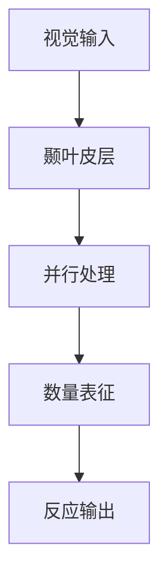

+++
title = 'Kaufman实验：视觉瞬时认知极限的开创性研究'
date = 2025-01-25T05:44:29+08:00
draft = false
author = "simons"
categories = ["心理学"]
tags = ["认知"]
description = "糟糕，写文章的时候忘记添加描述了！！！"
+++

# Kaufman实验：视觉瞬时认知极限的开创性研究

## 实验设计

### 核心设置
- 年份：1949年
- 研究者：Kaufman et al.
- 发表：《The Discrimination of Visual Number》

### 实验流程
1. **刺激呈现**
   - 随机点阵图案
   - 呈现时间：50毫秒（大约1/20秒）
   - 点数范围：1-200个
   - 位置：随机分布

2. **测量指标**
```python
class KaufmanExperiment:
    def __init__(self):
        self.exposure_time = 50  # 毫秒
        self.dot_ranges = range(1, 201)
        self.accuracy_threshold = 0.95

    def measure_subitizing(self):
        """测量瞬时计数能力"""
        for dots in self.dot_ranges:
            accuracy = self.test_recognition(dots)
            if accuracy < self.accuracy_threshold:
                return dots - 1
```

## 关键发现

### 认知阈值
1. **瞬时计数(Subitizing)**
   - 1-5个点：准确率>95%
   - 反应时间：250-350毫秒
   - 无需意识计数

2. **估算计数**
   - 6-7个点：准确率下降
   - 反应时间显著增加
   - 需要意识计数

### 神经机制


## 实验意义

1. **理论贡献**
   - 确立视觉认知极限
   - 发现瞬时计数现象
   - 奠定认知心理学基础

2. **应用价值**
   - 界面设计指导
   - 教育方法优化
   - 认知训练开发

这项实验为后续Miller's Law(7±2法则)等重要理论提供了基础，并持续影响着现代产品设计和用户体验优化。
