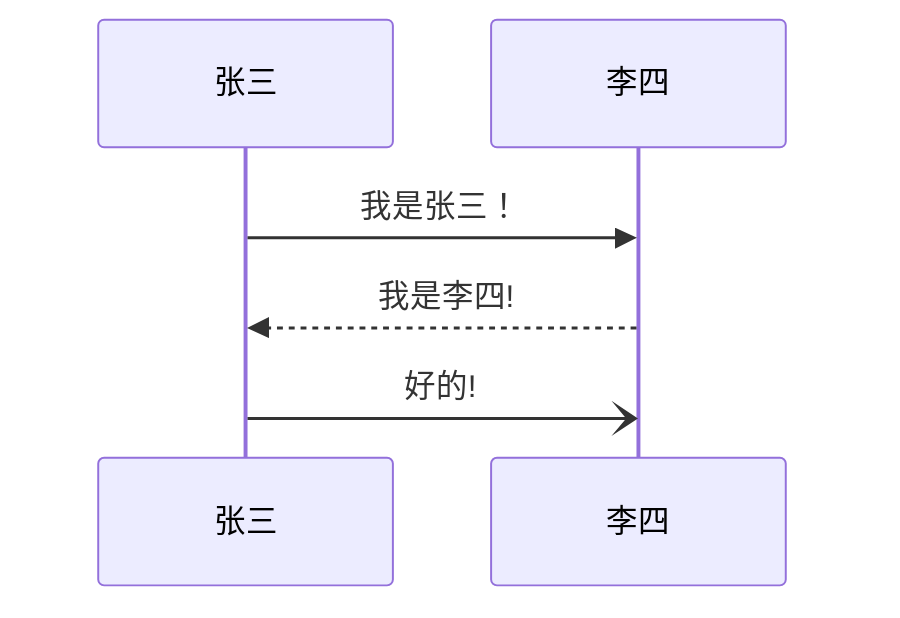
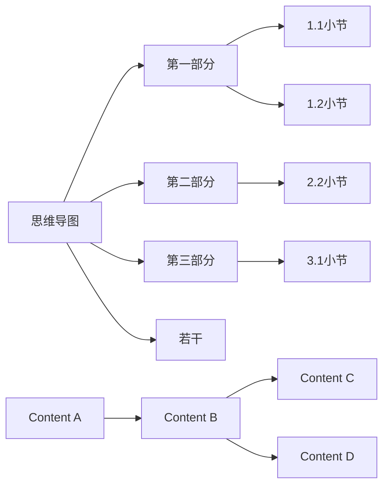
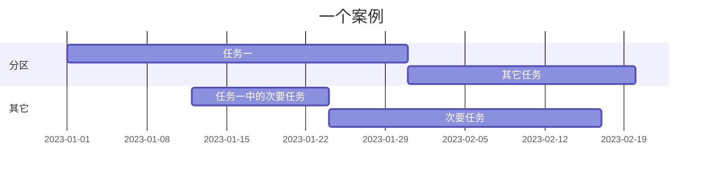
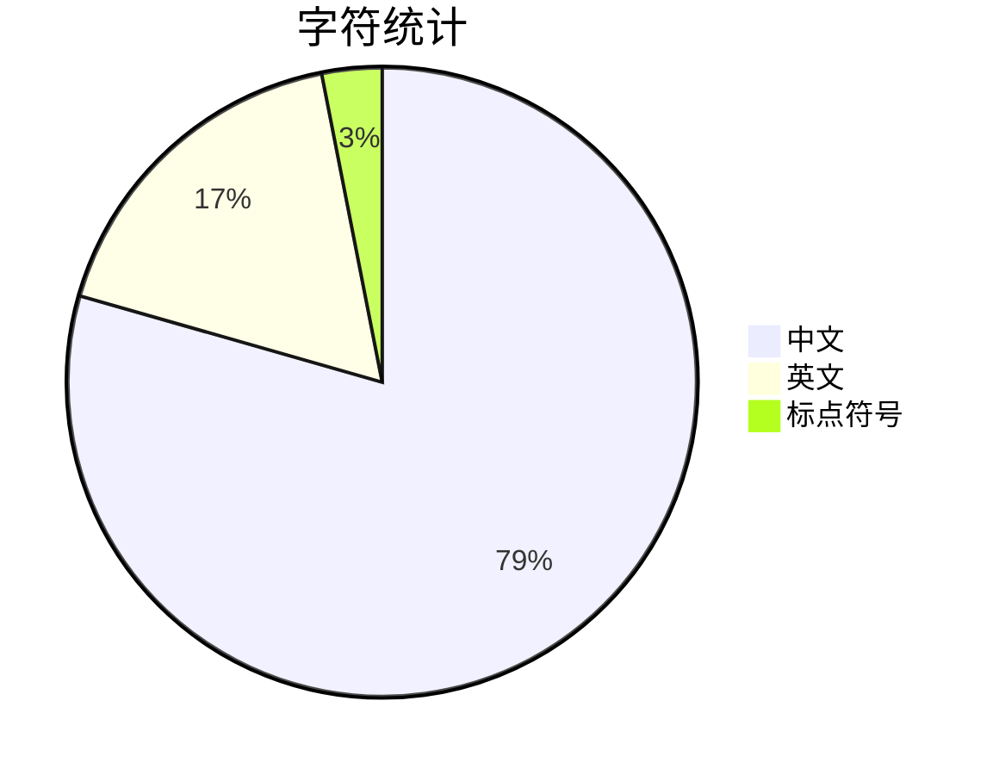

+++
date = '2025-01-21T01:53:21+08:00'
draft = false
title = 'Hugo-Focus 主题介绍'
toc = true
categories = ["博客"]
tags = ["hugo","配置"]
mermaid = true  # 启用 mermaid
codeRunners = true #启用运行代码
weight = 2
+++

# 一、简述

这是一个专注于编程的 Hugo 博客主题。

参考了我此前为 `Typora` 开发的 [`Thompsgo` 主题](https://github.com/caoyang2002/Typora-Themes-Thompsgo)

# 二、特性

## 1. 运行代码

**支持的语言：**
- `python (wasm)`
- `lisp (JavaScript 实现的 Common Lisp (JSCL) 解释器)`
- `cpp (playground)`
- `rust (playground)`
- `go (playground)`
- `ts (TypeScript 的 JavaScript 实现)`
- `js (原生)`

### 代码运行示例


#### 1. JavaScript 相关

```javascript
// 基础功能测试
console.log("=== 基础功能测试 ===");
console.log("Hello, JavaScript!");
const num = 10 + 20;
console.log("计算结果:", num);

// 完备性测试用例
function testBasicOperations() {
    console.log("\n=== 算术运算测试 ===");
    
    // 加法测试
    const addResult = 10 + 20;
    console.log(`加法测试: 10 + 20 = ${addResult}`);
    
    // 减法测试
    const subtractResult = 30 - 10;
    console.log(`减法测试: 30 - 10 = ${subtractResult}`);
    
    // 乘法测试
    const multiplyResult = 10 * 3;
    console.log(`乘法测试: 10 * 3 = ${multiplyResult}`);
    
    // 除法测试
    const divideResult = 30 / 2;
    console.log(`除法测试: 30 / 2 = ${divideResult}`);
    
    // 求余测试
    const modulusResult = 15 % 4;
    console.log(`求余测试: 15 % 4 = ${modulusResult}`);
}

function testDataType() {
    console.log("\n=== 数据类型测试 ===");
    
    // 数字类型
    const integer = 42;
    const float = 3.14;
    console.log(`整数: ${integer}, 类型: ${typeof integer}`);
    console.log(`浮点数: ${float}, 类型: ${typeof float}`);
    
    // 字符串类型
    const str = "测试字符串";
    console.log(`字符串: "${str}", 类型: ${typeof str}`);
    
    // 布尔类型
    const bool = true;
    console.log(`布尔值: ${bool}, 类型: ${typeof bool}`);
    
    // 未定义类型
    let undefinedVar;
    console.log(`未定义变量: ${undefinedVar}, 类型: ${typeof undefinedVar}`);
    
    // null类型
    const nullVar = null;
    console.log(`null值: ${nullVar}, 类型: ${typeof nullVar}`);
}

function testControlStructures() {
    console.log("\n=== 控制结构测试 ===");
    
    // 条件语句测试
    const testValue = 25;
    console.log(`测试值: ${testValue}`);
    
    if (testValue > 20) {
        console.log("条件测试: 值大于20");
    } else if (testValue > 10) {
        console.log("条件测试: 值大于10但小于等于20");
    } else {
        console.log("条件测试: 值小于等于10");
    }
    
    // 循环测试
    console.log("\n循环测试 - 输出1-5:");
    for (let i = 1; i <= 5; i++) {
        console.log(`  当前值: ${i}`);
    }
}

function testFunctions() {
    console.log("\n=== 函数测试 ===");
    
    // 函数定义和调用
    function greet(name) {
        return `你好, ${name}!`;
    }
    
    const greeting = greet("JavaScript");
    console.log(`函数调用结果: ${greeting}`);
    
    // 箭头函数测试
    const multiply = (a, b) => a * b;
    console.log(`箭头函数结果: 7 * 6 = ${multiply(7, 6)}`);
}

// 异常处理测试
function testErrorHandling() {
    console.log("\n=== 异常处理测试 ===");
    
    try {
        // 故意创建错误
        const result = 10 / 0;
        console.log(`除以零测试: 10 / 0 = ${result}`);
        
        // 访问不存在的属性
        const obj = { name: "测试对象" };
        console.log(`安全属性访问: ${obj.name}`);
        console.log(`不存在属性访问: ${obj.age}`); // 返回undefined，不会报错
        
        // JSON解析测试
        const validJSON = '{"key": "value"}';
        const parsed = JSON.parse(validJSON);
        console.log(`JSON解析测试: ${JSON.stringify(parsed)}`);
        
    } catch (error) {
        console.log(`捕获到错误: ${error.message}`);
    }
}

// 运行所有测试
function runAllTests() {
    console.log("开始程序完备性测试...");
    console.log("=".repeat(50));
    
    testBasicOperations();
    testDataType();
    testControlStructures();
    testFunctions();
    testErrorHandling();
    
    console.log("\n" + "=".repeat(50));
    console.log("程序完备性测试完成！");
}

// 执行测试
runAllTests();
```

#### 2. TypeScript 相关
```typescript
console.log("Hello, TypeScript!");

const num = 10 + 20;
console.log(num);
```

## 3. Python 相关
```python
print("Hello, Python!")
```

## 4. C++ 相关
```cpp
#include <iostream>
using namespace std;

int main() {
    cout << "Hello, C++!" << endl;
    return 0;
}
```

## 5. C 语言
```c
#include <stdio.h>

int main() {
    printf("Hello, C!\n");
    return 0;
}
```

## 6. C# 相关
```csharp
using System;

class Program {
    static void Main() {
        Console.WriteLine("Hello, C#!");
    }
}
```

## 7. Java 相关
```java
public class HelloWorld {
    public static void main(String[] args) {
        System.out.println("Hello, Java!");
    }
}
```

## 8. HTML 相关
```html
<!DOCTYPE html>
<html>
<body>
    <h1>Hello, HTML!</h1>
</body>
</html>
```

## 9. CSS 相关
```css
body::before {
    content: "Hello, CSS!";
    display: block;
    font-size: 24px;
    color: blue;
}
```

## 10. PHP 相关
```php
<?php
echo "Hello, PHP!";
?>
```

## 11. Ruby 相关
```ruby
puts "Hello, Ruby!"
```

## 12. Go 相关
```go
package main

import "fmt"

func main() {
    fmt.Println("Hello, Go!")
}
```

## 13. Rust 相关
```rust
fn main() {
    println!("Hello, Rust!");
}
```

## 14. Swift 相关
```swift
print("Hello, Swift!")
```

## 15. Kotlin 相关
```kotlin
fun main() {
    println("Hello, Kotlin!")
}
```

## 16. SQL 相关
```sql
SELECT 'Hello, SQL!' AS greeting;
```

## 17. Shell/Bash 相关
```bash
echo "Hello, Bash!"
```

## 18. Markdown
```markdown
# Hello, Markdown!

This is a markdown document.
```

## 19. Docker
```dockerfile
FROM alpine
CMD echo "Hello, Docker!"
```

## 20. Git
```git
# Git commit message
git commit -m "Hello, Git!"
```

## 21. Lua
```lua
print("Hello, Lua!")
```

## 22. Perl
```perl
print "Hello, Perl!\n";
```

## 23. R
```r
# 测试1: 简单的 print
print("Hello, R!")

# 测试2: 使用 cat (直接输出)
cat("Hello from cat\n")

# 测试3: 计算表达式
1 + 2 * 3

# 测试4: 赋值和打印
x <- "Test"
print(x)
```

## 24. Lisp
```lisp
(format t "Hello, Lisp!")
```

## 25. Scala
```scala
object HelloWorld {
  def main(args: Array[String]): Unit = {
    println("Hello, Scala!")
  }
}
```

## 26. Dart
```dart
void main() {
  print('Hello, Dart!');
}
```

## 27. Elixir
```elixir
IO.puts "Hello, Elixir!"
```

## 28. Haskell
```haskell
main = putStrLn "Hello, Haskell!"
```

## 29. OCaml
```ocaml
print_endline "Hello, OCaml!"
```

## 30. Clojure
```clojure
(println "Hello, Clojure!")
```

## 31. Erlang
```erlang
-module(hello).
-export([start/0]).

start() ->
    io:format("Hello, Erlang!~n").
```

## 32. MATLAB
```matlab
disp('Hello, MATLAB!')
```

## 33. JSON
```json
{
  "message": "Hello, JSON!"
}
```

## 34. YAML
```yaml
message: Hello, YAML!
```

## 35. XML
```xml
<?xml version="1.0"?>
<message>Hello, XML!</message>
```

## 36. TOML
```toml
message = "Hello, TOML!"
```

## 37. INI/CONF
```ini
[section]
message = Hello, INI!
```

## 38. CSV
```csv
message
Hello, CSV!
```

## 39. TXT/TEXT
```txt
Hello, Text File!
```

## 40. LOG
```log
[INFO] Hello, Log File!
```

## 其他框架/扩展示例：

### React (JSX)
```jsx
function App() {
  return <h1>Hello, React!</h1>;
}
```

### Vue
```vue
<template>
  <h1>{{ message }}</h1>
</template>

<script>
export default {
  data() {
    return {
      message: 'Hello, Vue!'
    }
  }
}
</script>
```

### Svelte
```svelte
<h1>Hello, Svelte!</h1>
```

### Next.js
```jsx
// pages/index.js
export default function Home() {
  return <h1>Hello, Next.js!</h1>;
}
```

### Angular (TypeScript)
```typescript
import { Component } from '@angular/core';

@Component({
  selector: 'app-root',
  template: '<h1>Hello, Angular!</h1>'
})
export class AppComponent {}
```

### SCSS/SASS
```scss
.hello {
  content: "Hello, SCSS!";
}
```

### Less
```less
.hello {
  content: "Hello, Less!";
}
```

### Stylus
```stylus
.hello
  content "Hello, Stylus!"
```

### PostgreSQL (扩展 SQL)
```sql
SELECT 'Hello, PostgreSQL!'::text;
```

### PowerShell
```powershell
Write-Host "Hello, PowerShell!"
```


## 2. mermaid 图表



## 3. 数学公式

$$
\mathbf{V}_1 \times \mathbf{V}_2 =  \begin{vmatrix}
    \mathbf{i} & \mathbf{j} & \mathbf{k} \\
    \frac{\partial X}{\partial u} &  \frac{\partial Y}{\partial u} & 0 \\
    \frac{\partial X}{\partial v} &  \frac{\partial Y}{\partial v} & 0 \\
    \end{vmatrix}
$$

$1+1=2$

## 4. 效果

### 文字

- 彩色标签
- 抖音字
- 空心字
- 闪烁字
- 黑底字
- 彩虹字
- 隐藏文本
- 提示块

### 图片

- 单色
- 模糊
- 半透明
- 反色
- 圆角
- 边框

## 5. 多语言

参考 hugo 的多语言配置，默认使用路径语言参数（例如`/en`）

## 6. 目录

在移动端支持折叠和展开，并支持目录标题跳转


## 7. 搜索

使用模糊搜索库 `fuse.js` 实现搜索功能

## 8. 博客统计

- 博客文章基础统计
- 标签云
- 热门文章
- 归档


## 9. 日/夜模式

参考 `Hugo-Paper`


## 10. 评论

参考 `Hugo-Paper`

## 11. 时间线

<div alt="timeline">
    <div alt="timenode">
        <div alt="meta">2021.1 ~ 2022.2 <a href="#">开发</a></div>
        <div alt="body">
            dev
        </div>
    </div>
    <div alt="timenode">
        <div alt="meta">2022.4 ~ 2023.3 <a href="#">设计</a></div>
        <div alt="body">
            des
        </div>
    </div>
</div>

## 12. 折叠菜单

<details>
  <summary>I have keys but no locks. I have space but no room. You can enter but can't leave. What am I?</summary>
  A keyboard.
</details>

## 13. 嵌入

<iframe frameborder="no" border="0" marginwidth="0" marginheight="0" width=330 height=450 src="//music.163.com/outchain/player?type=0&id=2870133096&auto=1&height=430"></iframe>


# 三、基本编辑

> `Markdown`以下称作`md`
>
> `Thompsgo主题`以下称作`主题`
>
> `mermaid`，一种编辑和渲染器，可以编辑并展示思维导图、流程图、序列图、甘特图等多种矢量图形的，`typora`可直接使用
>
> 部分`markdown`不支持的样式比如<u>带下划线文字</u>或者 <span style="color:red">带颜色的文字</span>可以通过`html`实现


## 1. 基础语法

### 1.1 md语法

[markdown语法-菜鸟教程](https://www.runoob.com/markdown/md-tutorial.html)

- 如果不起作用请检查是否有空格或者尝试换行


$$
f(x) = \int_{-\infty}^{\infty} \hat{f}(\xi) e^{2 \pi i \xi x} d\xi
$$

1. 标题

   ```markdown
   # 一级标题
   ## 二级标题
   ### 三级标题
   #### 四级标题
   ##### 五级标题
   ###### 六级标题
   ```

2. 字体样式

   ```markdown
   斜体：
   *斜体文本*
   _斜体文本_

   粗体：
   **粗体文本**
   __粗体文本__

   斜粗体：
   ***粗斜体文本***
   ___粗斜体文本___

   删除线：
   ~~BAIDU.COM~~
   ```

   - 示例

     *斜体文本*
     **粗体文本**
     ***粗斜体文本***
     ~~BAIDU.COM~~

3. 分割线

   ```markdown
   以下任意一种都可以
   ***
   *****
   ---
   ----------
   ```

   - 示例

     ----------

4. 脚注

   ```markdown
   [^要注明的文本]


   您可以像这样创建脚注[^footnote].
[^footnote]: Here is the *text* of the **footnote**.
   ```

   - 示例

     创建脚注格式类似这样 [^注]。
     [^注]: 这是一个注释

5. 列表（可嵌套）

   ```markdown
   普通列表 字符 空格
   * 第一项
   * 第二项
   * 第三项

   + 第一项
   + 第二项
   + 第三项

   有序列表：数字 点 空格
   1. 第一项
   2. 第二项
   3. 第三项


   - 第一项
   - 第二项
   - 第三项

   嵌套列表：数字/字符 点 空格 数字/字符 点 空格
   1. 第一项：
       - 第一项嵌套的第一个元素
       - 第一项嵌套的第二个元素
   2. 第二项：
       - 第二项嵌套的第一个元素
       - 第二项嵌套的第二个元素
   ```

   - 示例
     1. 第一项：
         - 第一项嵌套的第一个元素
         - 第一项嵌套的第二个元素
     2. 第二项：
         - 第二项嵌套的第一个元素
         - 第二项嵌套的第二个元素

6. 区块（引用）

   ```markdown
   单层饮用：尖括号 空格
   > 区块引用
   > 菜鸟教程
   > 学的不仅是技术更是梦想

   嵌套饮用：尖括号 空格 尖括号 空格
   > 最外层
   > > 第一层嵌套
   > > > 第二层嵌套

   复合使用：
   区块中使用列表：
   > 1. 第一项
   > 2. 第二项
   > + 第一项
   > + 第二项
   > + 第三项

   列表中使用区块
   * 第一项
       > 菜鸟教程
       > 学的不仅是技术更是梦想
   * 第二项
   ```

   - 示例

     * 第一项
         > 区块（引用）
     * 第二项

7. 代码

   ````markdown
   使用符号： `
   `代码`

   代码块：
   ```代码语言
   代码
   ```
   ````

   - 示例

     ```代码语言
     代码
     ```

8. 链接

   ```mariadb
   [链接名称](链接地址)
   [菜鸟教程](https://www.runoob.com)

   或者

   <链接地址>
   <https://www.runoob.com>
   ```

   - 示例

     [菜鸟教程](https://www.runoob.com)

     <https://www.runoob.com>

9. 图片

   ```mariadb
   图片地址可以是本地或网络地址
   

   
   ```

   - 使用HTML标签指定图片高度和宽度

   ```markdown
   
   ```

   - 示例

     

10. 表格

    ```markdown
    |  表头   | 表头  |
    |  ----  | ----  |
    | 单元格  | 单元格 |
    | 单元格  | 单元格 |
    ```

    ```markdown
    | 左对齐 | 右对齐 | 居中对齐 |
    | :-----| ----: | :----: |
    | 单元格 | 单元格 | 单元格 |
    | 单元格 | 单元格 | 单元格 |
    ```

    - 示例

      | 左对齐 | 右对齐 | 居中对齐 |
      | :----- | -----: | :------: |
      | 单元格 | 单元格 |  单元格  |
      | 单元格 | 单元格 |  单元格  |

11. 任务列表

    ```markdown
    - [ ] 未完成
    - [x] 完成
    ```

    - 示例
      - [x] 未完成
      - [x] 完成

12. html支持

    ```markdown
    <kbd> <b> <i> <em> <sup> <sub> <br>

    例如：
    <kbd>Ctrl</kbd>+<kbd>Alt</kbd>+<kbd>Del</kbd>重启
    ```

    - 示例

      <kbd>Ctrl</kbd>+<kbd>Alt</kbd>+<kbd>Del</kbd>重启


13. 转义

    ```markdown
    \   反斜线
    支持的符号 （这些符号在md中有意义，可以进行一些格式操作，反斜线可以让它们以文本显示）
    `   反引号
    *   星号
    _   下划线
    {}  花括号
    []  方括号
    ()  小括号
    #   井字号
    +   加号
    -   减号
    .   英文句点
    !   感叹号
    ```

    - 示例

      \# \- \!


14. 公式

    - 支持[KaTeX](https://github.com/Khan/KaTeX) 或者 [MathJax](https://github.com/mathjax/MathJax) 公式渲染器

    ```markdown
    $$
    \begin{Bmatrix}
       a & b \\
       c & d
    \end{Bmatrix}
    $$
    ```

    - 示例

    $$
    \begin{Bmatrix}
       a & b \\
       c & d
    \end{Bmatrix}
    $$

    - ```mariadb
      $$
      \begin{CD}
      A @>a>> B \\
      @VbVV @AAcA \\
      C @= D
      \end{CD}
      $$
      ```

    - $$
      \begin{CD}
      A @>a>> B \\
      @VbVV @AAcA \\
      C @= D
      \end{CD}
      $$

    - ```markdown
      $$
      \mathbf{V}_1 \times \mathbf{V}_2 =  \begin{vmatrix}
          \mathbf{i} & \mathbf{j} & \mathbf{k} \\
          \frac{\partial X}{\partial u} &  \frac{\partial Y}{\partial u} & 0 \\
          \frac{\partial X}{\partial v} &  \frac{\partial Y}{\partial v} & 0 \\
          \end{vmatrix}
      $$
      ```

    - $$
      \mathbf{V}_1 \times \mathbf{V}_2 =  \begin{vmatrix}
          \mathbf{i} & \mathbf{j} & \mathbf{k} \\
          \frac{\partial X}{\partial u} &  \frac{\partial Y}{\partial u} & 0 \\
          \frac{\partial X}{\partial v} &  \frac{\partial Y}{\partial v} & 0 \\
          \end{vmatrix}
      $$

    ```markdown
     $\lim_{x \to \infty} \exp(-x) = 0$
    ```

     $\lim_{x \to \infty} \exp(-x) = 0$

15.


15. 表情

    ```markdown
    :smile:
    ```

    - 示例

    :smile:

    :tent:

    :hand:

    :camera:

16.

17. 目录

    ```markdown
    自动依据‘#’标签生成目录
    [toc]
    ```


18. YAML

```markdown
Typora 现在支持 YAML Front Matter 。 在文章顶部输入 --- 然后按 Enter 键将引入一个，或者从菜单中插入一个元数据块。
```

2.


### Typora支持

1. YAML

   - 这是一种编写元数据的数据序列化语言

   - 为什么使用

     > - 我们来看markdown的`#`其实表示的是`header`，严格意义上来说是一级标题而不是文章标题`title`，放在论文里来说就是`header 1`可以是前言、方法、结果、讨论等，但不是论文的题目。如此一来我们就需要一个用来存放title的地方，这就是metadata的存在的意义，当然它不仅仅能容纳title，还可以加上author、keywords、abstract等信息[^知乎]。这些数据可以在文件的详细信息里面看到。
     >
     > - 实际上YAML还可以保存用于脚本的变量，以实现各种导出时的特殊要求

   - 使用方法

     ```markdown
     在文章顶部输入 --- 然后按 Enter 键将引入一个，或者从菜单中插入一个元数据块。
     ```


     - 添加文章作者和关键字等信息

     ```yaml
     ---
     title:  "This is the title: it contains a colon"
     author:
     - Author One
     - Author Two
     keywords: [nothing, nothingness]
     abstract: |
       This is the abstract.

       It consists of two paragraphs.
     ---
     ```

     - 例如

       ```yaml
       ---
       # 注释：导出的yaml设置
       title: Thompsgo使用方法
       author: simons
       creator: simons
       subject: Usage
       keywords: [使用方法、markdown、HTML、YAML]
       info: 这是一本关于thompsgo主题的手册，内含markdown、mermiad、html等语言和的基础语法。本主题由 @simons 开发，开源地址：https://github.io/caoyang2002
       ---
       ```

       ```html
       <!--注释：导出的html设置-->
       <meta title="title" content="${title}">
       <meta info="info" content="${info}">
       <meta author="author" content="${author}">

       <div id='_export_cover' style="height:100vh;">
         <div id='_export_title' style="margin-top: 10%;text-align: center;font-size: 10rem;">
         </div>
           <hr>
       <div>
         <div id='_export_info' style="margin-top: 4%;text-align: center;font-size: 1.5rem;">
       </div>
       <p style="margin-left:10%;font-size: 1.8rem"> &#128187; Mac专用 &#129412;</p>
       <div id='_export_author' style="margin-left: 80%;font-size: 2.5rem;">
       </div>

       <script>
       var $cover = document.querySelector("#_export_cover");
       var title = document.querySelector("meta[title='title']").getAttribute("content");
       var info = document.querySelector("meta[info='info']").getAttribute("content");
       var author = document.querySelector("meta[author='author']").getAttribute("content");

       if(!title || title == "${title}" || !author || author == "${author}" || !info || info == "${info}") {
         // no title author info
         $cover.remove();
       } else {
         document.body.insertBefore($cover, document.body.childNodes[0])
         $cover.querySelector("#_export_title").textContent = title;
         $cover.querySelector("#_export_info").textContent = info;
         $cover.querySelector("#_export_author").textContent = author;
       }
       </script>
       ```


2. 嵌入动画

   ```html
   <iframe height='265' scrolling='no' title='Fancy Animated SVG Menu' src='http://codepen.io/jeangontijo/embed/OxVywj/?height=265&theme-id=0&default-tab=css,result&embed-version=2' frameborder='no' allowtransparency='true' allowfullscreen='true' style='width: 100%;'></iframe>
   ```

   - 示例

     <iframe height='265' scrolling='no' title='Fancy Animated SVG Menu' src='http://codepen.io/jeangontijo/embed/OxVywj/?height=265&theme-id=0&default-tab=css,result&embed-version=2' frameborder='no' allowtransparency='true' allowfullscreen='true' style='width: 100%;'></iframe>


3. 嵌入视频

   ```html
   <iframe src="//player.bilibili.com/player.html?aid=12178417&bvid=BV1Ux411q7qd&cid=20076875&page=1" height="770"   scrolling="no" border="0" frameborder="no" framespacing="0" allowfullscreen="true"> </iframe>
   ```


   <iframe src="//player.bilibili.com/player.html?aid=12178417&bvid=BV1Ux411q7qd&cid=20076875&page=1" height="770"  scrolling="no" border="0" frameborder="no" framespacing="0" allowfullscreen="true"> </iframe>

4. 嵌入音频

   ```markdown
   <iframe frameborder="no" border="0" marginwidth="0" marginheight="0" width=330 height=450 src="//music.163.com/outchain/player?type=0&id=2870133096&auto=1&height=430"></iframe>
   ```

   - 示例

   <iframe frameborder="no" border="0" marginwidth="0" marginheight="0" width=330 height=450 src="//music.163.com/outchain/player?type=0&id=2870133096&auto=1&height=430"></iframe

   <iframe frameborder="no" border="0" marginwidth="0" marginheight="0" width=330 height=86 src="//music.163.com/outchain/player?type=2&id=25729017&auto=1&height=66"></iframe>

5. fds

6. dsf

7. fsdfsdfds

8. fdsf

9. fsd

10. fsd

### 各种导图（mermaid）
#### 1.思维导图

   - 空格敏感

   ```mermaid
   mindmap
     root((思维导图))
       节点一
         记录1.1
         ::icon(fa fa-book)
         节点1.1
           记录1.1.1
       节点二
         记录2.1
         记录2.2
           节点2.1
               记录2.1.1
         			记录2.1.2
             	记录2.1.3
       节点三
         记录3.1
         记录3.2
   ```


  - 基础

  - 语法

    - 形状

      - 默认

        ```mermaid
        mindmap
            I am the default shape
        ```

      - `[]`矩形

         ```mermaid
         mindmap
             id[I am a square]
         ```

       - 圆角矩形

         ```mermaid
         mindmap
             id(I am a rounded square)
         ```


       - 圆形

         ```mermaid
         mindmap
             id((I am a circle))
         ```


       - 爆炸形

         ```mermaid
         mindmap
             id))I am a bang((
         ```


       - 云朵形

         ```mermaid
         mindmap
             id)I am a cloud(
         ```


       - 六边形

         ```mermaid
         mindmap
             id{{I am a hexagon}}
         ```


     - `::icon()`图标

       ```mermaid
       mindmap
           Root
               A
               ::icon(fa fa-book)
               B(B)
               ::icon(fa fa-car)
       ```


     - 级别

       ```mermaid
       mindmap
           Root
               A[A]
               :::urgent large
               B(B)
               C
       ```


     - markdown字符串

       ```mermaid
       mindmap
           id1["**Root** with
       a second line
       Unicode works too: 🤓"]
             id2["`The dog in **the** hog... a *very long text* that wraps to a new line`"]
             id3[Regular labels still works]
       ```


     - 翻动

     - 翻动

   - 语法

   - 语法


#### 2. 顺序图


- 基础

- 语法

  - `actor 名称`象形图形

  ```mermaid
  sequenceDiagram
      actor 张三
      actor 李四
      张三->>李四: 你好，李四，我是张三！
      李四->>张三: 你好，张三！
  ```

  - `participant A as A的别名` 使用别名

    ```mermaid
    sequenceDiagram
        participant Z as 张三
        participant L as 李四
        Z->>L: 你好，李四！
        L->>Z: 你好!
    ```

  - 使用盒子分组

    ```markdown
    box 组名

    box 颜色 组名
    participant 马克
    participant B as 杰森                  可以使用as取别名
    end


    box Group without description
    ... actors ...
    end
    box 指定颜色
    box rgb(33,66,99)
    ... actors ...
    end
    box 指定透明
    box transparent Aqua
    ... actors ...
    end
    ```

    - 盒子（分组）

      ```mermaid
      sequenceDiagram
          box rgb(255,34,67) 场景组
          participant A as 马克
          participant B as 杰森
          end
          box orange 后期组
          participant C as 泰克
          end

          box white 道具组
          participant  D as 斯坦
          end

          box lightblue演员组
          participant 瓦特
          participant E as 托尼
          end

          box transparent 导演组
          participant F as 塔克
          end

          A->>B: 不错
          B->>E: 演员呢
          A->>D: 换道具了
          B->>C: 后期组在吗?
          A->>F: 我是马克
          F->>D: 我是塔克
          E->>F: 我是托尼
          瓦特->>F: 这里是演员组

      ```

  - 可以使用的箭头

    | 类型   | 描述                         |
    | :----- | :--------------------------- |
    | `->`   | 没有箭头的实线               |
    | `-->`  | 没有箭头的虚线               |
    | `->>`  | 带箭头的实线                 |
    | `-->>` | 带箭头的虚线                 |
    | `-x`   | 末尾有十字的实线             |
    | `--x`  | 末端有十字的虚线。           |
    | `-)`   | 尾端有开箭头的实线（异步）   |
    | `--)`  | 末端有开放箭头的虚线（异步） |

  - `deactivate`保持对象（`activate`激活对象）

    -  通常用于表示一个完整的内容，避免分割造成的歧义

    ```mermaid
    sequenceDiagram
        张三->>李四: 我是可以使用的对象
        activate 李四
        李四-->>张三: Great!
        deactivate 李四
        张三->>李四: 刚才被停用了
        李四-->>张三: Great!
        activate 李四
        李四-->>张三: Great!
    ```

    - 快捷方式：在消息箭头上附加+/-后缀 `->>+`  `-->>-`

    ```mermaid
    sequenceDiagram
        张三->>+李四: Hello John, how are you?
        李四-->>-张三: Great!
    ```

    - 堆叠

      ```mermaid
      sequenceDiagram
          张三->>+李四: Hello John, how are you?
          张三->>+李四: John, can you hear me?
          李四-->>-张三: Hi Alice, I can hear you!
          李四-->>-张三: I feel great!
      ```

    - 注释

      ```mermaid
      sequenceDiagram
          participant 李四
          Note right of 李四: 这是注释
      ```

      - 跨对象注释

        ```mermaid
        sequenceDiagram
            张三->>李四: 你好，李四
            Note over 张三,李四: 这是注释
        ```

      - 注释使用换行符

        ```mermaid
        sequenceDiagram
            张三->>李四: 你好
            Note over 张三,李四: 尖括号内使用br斜杠<br/>换行
        ```

    - 循环

      ```markdown
      loop 循环说明
      	循环内容
      end
      ```


      ```mermaid
    sequenceDiagram
          张三->李四: 接下来是一个循环
          loop 循环的说明
              李四-->张三: 循环的内容
          end
      ```


    - 替换和选择

      ```markdown
    可以在序列图中表达替代路径。

      alt 描述信息
      ... statements ...
      else
      ... statements ...
      end

      或者

      如果有可选的序列（如果没有其他）

      opt 描述信息
      ... statements ...
      end
      ```


      ```mermaid
    sequenceDiagram
          张三->>李四: 怎么样
          alt 生病了
              李四->>张三: 不太好:(
          else 健康
              李四->>张三: 很好
          end
          opt 额外的
              李四->>张三: 谢谢关心
          end
      ```

    - 并行发生

      ```markdown
    可以显示并行发生的行为。

      par [Action 1]
      ... statements ...
      and [Action 2]
      ... statements ...
      and [Action N]
      ... statements ...
      end
      ```


      ```mermaid
    sequenceDiagram
          par 张三 to 李四
              张三->>李四: 你好
          and 张三 to 王五
              张三->>王五: 你好
          end
          李四-->>张三: 你好，张三
          王五-->>张三: 你好，张三
      ```

      - 嵌套平行块

        ```mermaid
        sequenceDiagram
            par 张三 to 李四
                张三->>李四: Go help John
            and 张三 to 王五
                张三->>王五: I want this done today
                par 王五 to 赵六
                    王五->>赵六: Can we do this today?
                and 王五 to 小明
                    王五->>小明: Can you help us today?
                end
            end
        ```


    - 条件触发

      ```markdown
    可以显示必须通过有条件处理情况自动发生的操作。
      critical [Action that must be performed]
      ... statements ...
      option [Circumstance A]
      ... statements ...
      option [Circumstance B]
      ... statements ...
      end
      ```

      ```mermaid
    sequenceDiagram
          critical 拨打电话给李四
              张三-->李四: 打电话
          option 话费不足
              张三-->张三: 通话失败
          option 被拒绝
              张三-->张三: 再次通话失败
          end
      ```

      ```mermaid
    sequenceDiagram
          critical 张三打电话给李四
              张三-->李四: 成功
          end
      ```


    - 中断

      ```markdown
    可以指示流中序列的停止（通常用于模拟异常）。

      break [something happened]
      ... statements ...
      end
      ```

      ```mermaid
    sequenceDiagram
          消费者-->商家: 买一个笔记本
          商家-->仓库: 查仓库的库存
          break 无库存
              商家-->消费者: 提示无库存
          end
          商家-->财务系统: 财务登记
      ```


    - 背景高亮显示

      ```markdown
    可以通过提供彩色背景来突出显示流。
      颜色是使用rgb和rgba语法定义的。

      rect rgb(0, 255, 0)
      ... content ...
      end
      rect rgba(0, 0, 255, .1)
      ... content ...
      end
      ```

      ```mermaid
    sequenceDiagram
          participant Alice as 张三
          participant John as 李四

          rect rgb(191, 223, 255)
          note right of Alice: 张三给李四打电话
          Alice->>+John: 你好，李四！
          rect rgb(200, 150, 255)
          Alice->>+John: 李四，你能听到我说话吗？
          John-->>-Alice: 我可以听到
          end
          John-->>-Alice: 很清晰
          end
          Alice ->>+ John: 今晚有空看比赛吗？
          John -->>- Alice: 可以的！
      ```


    - `%%注释内容`，换行结束注释

      ```mermaid
    sequenceDiagram
          A->>J: Hello J, how are you?
          %% this is a comment
          J-->>A: Great!
      ```

    - 转义字符

      ```mermaid
    sequenceDiagram
          A->>B: I #9829; you!
          B->>A: I #9829; you #infin; times more!
      ```


    - 翻动分

    -  赛

    - 翻动

  - 语法

- 扽色

- 冬粉

  - 使用`end`时，建议用`[] 或 {} 或 ()`括起来

#### 3. 流程图`flowchart`

- 使用`graph`也可以

- 基础：
  - 节点：箭头（连接线）指向的图形
  - 内容：节点上的文字
  - 对空格不敏感
  - `---`三个减号表示线，最后一个减号改为`>`可带箭头，增加`-`可增加长度

````markdown
	```mermaid
	graph LR
	思维导图--> 第一部分
	第一部分-->1.1小节
	第一部分-->1.2小节

	思维导图--> 第二部分
	第二部分-->2.2小节

	思维导图--> 第三部分
	第三部分--> 3.1小节
	思维导图--> 若干
```
````



- 语法：

  - 排列方式

    - `graph LR` 从左到右排列，RL相反
    - `graph BT` 从上到下排列，TB相反

  - 连接方式

    - `-->` 箭头连接

      ```mermaid
      graph LR
      A --> B
      ```


    - `---` 无箭头连接

      ```mermaid
      graph LR
      A---B
      ```


    - `--连接线上带文字---` 或 `C---|连接线上带文字|D`连接线上带文字

      ```mermaid
      graph LR
      A-- 连接上的文字 ---B
      C---|连接线上带文字|D
      ```


    - `-->箭头连接线上带文字---` 或 `C--->|箭头连接线上带文字|D`箭头连接线上带文字

      ```mermaid
      graph LR
      A--> 连接上的文字 -->B
      C--->|连接线上带文字|D
      ```


    - `A-.->B`虚线连接

      ```mermaid
      graph LR
         A-.->B
      ```

    - `A-.带文字的虚线连接.->B`带文字的虚线连接

      ```mermaid
      graph LR
      A-.带文字的虚线连接.->B
      ```


    - `A==>B`粗连接

      ```mermaid
      graph LR
      A==>B
      ```


    - `A == 带文本的粗连接 ==> B `带文本的粗连接


      ```mermaid
      graph LR
      A == 带文本的粗连接 ==> B
      ```

    -

    - 特殊字符的显示

      ```mermaid
       graph LR
      A["这里有个引号#quot;"] -->B["特殊字符:#9829;"]
      ```

    - 破坏语法的字符`!`


      ```mermaid
      graph LR
      A["破坏语法的特殊字符 ! "]
      ```


  - 节点形状

    - `A(圆角矩形)` “A”和“圆角矩形”可以是任意字符

      ```mermaid
      graph RL
      A(圆角矩形)
      ```

    - A[矩形]

      ```mermaid
      graph RL
      A[矩形]
      ```


    - A((圆形))

      ```mermaid
      graph RL
      A((圆形))
      ```


    - A>非对称形状]

      ```mermaid
      graph RL
      A>非对称形状]
      ```


    - A{菱形}

      ```mermaid
      graph RL
      A{菱形}
      ```


  - 文字（别名）

    - `start[开始]`start将作为节点，显示的字符为开始

  - 子图

    ```markdown
    	subgraph 图像块标题1
    	图像快中的连接
    	subgraph 图像块标题2
    	图像快中的连接
    	......
      end
    ```

    ```mermaid
    graph TB
        c1-->a2
        subgraph one
        a1-->a2
        end
        subgraph two
        b1-->b2
        end
        subgraph three
        c1-->c2
        end
    ```

  - 带样式的连接

    - 参数
      - `fill`：内部填充色
      - `stroke`：描边颜色
      - `stroke-width`：描边宽度
      - `stroke-dasharray`: 虚线描边（虚线块的宽度  虚线空格的宽度）

    ```mermaid
    graph LR
        A(Start)-->B(Stop)
        style A fill:#f9f,stroke:#333,stroke-width:4px
        style B fill:#ccf,stroke:#f66,stroke-width:2px,stroke-dasharray: 5 5

         style C fill:#f9f,stroke:#993,stroke-width:4px
         style D fill:#ccf,stroke:#f6f6,stroke-width:6px,stroke-dasharray: 4 2
    ```

- 对[fontawesome](https://fontawesome.com.cn/v5)的基本支持
  - 图标通过语法`"fa:图标名称"`来获取

    ```mermaid
    graph TD
        B["fa:fa-twitter 和平"]
        B-->C[fa:fa-ban 禁止]
        B-->D(fa:fa-spinner);
        B-->E(fa:fa-camera-retro 也许?);
        E-->F(fa:fa-car 汽车)
        B-->G(fa:fa-file 文件)
    ```


  - fds

  - fdsfsd

#### 4. 甘特图




> 甘特图将把每个计划的任务记录为一个从左向右延伸的连续条。x轴表示时间，y记录不同的任务和完成它们的顺序。
>
> 重要的是要记住，当特定于任务的日期、日期或日期集合被“排除”时，甘特图将通过向右延长相等的天数来适应这些变化，而不是在任务内部创建空隙。但是，如果排除的日期在设置为连续开始的两个任务之间，则排除的日期将以图形方式跳过并留空，以下任务将在排除日期结束后开始。
>
> 甘特图可用于跟踪项目完成所需的时间，但它也可以用于以图形方式表示“非工作日”，只需进行一些调整。

1. 语法

   1. ```mermaid
      gantt
          dateFormat  YYYY-MM-DD
          title       Adding GANTT diagram functionality to mermaid
          excludes    weekends
          %% (`excludes` accepts specific dates in YYYY-MM-DD format, days of the week ("sunday") or "weekends", but not the word "weekdays".)

          section A section
          Completed task            :done,    des1, 2023-01-06,2023-01-08
          Active task               :active,  des2, 2023-01-09, 3d
          Future task               :         des3, after des2, 5d
          Future task2              :         des4, after des3, 5d

          section Critical tasks
          Completed task in the critical line :crit, done, 2023-01-06,24h
          Implement parser and jison          :crit, done, after des1, 2d
          Create tests for parser             :crit, active, 3d
          Future task in critical line        :crit, 5d
          Create tests for renderer           :2d
          Add to mermaid                      :1d
          Functionality added                 :milestone, 2023-01-25, 0d

          section Documentation
          Describe gantt syntax               :active, a1, after des1, 3d
          Add gantt diagram to demo page      :after a1  , 20h
          Add another diagram to demo page    :doc1, after a1  , 48h

          section Last section
          Describe gantt syntax               :after doc1, 3d
          Add gantt diagram to demo page      :20h
          Add another diagram to demo page    :48h
      ```

   2. 由多个空间分割的依赖项

      ```mermaid
      gantt
          apple :a, 2023-07-20, 1w
          banana :crit, b, 2023-07-23, 1d
          cherry :active, c, after b a, 1d
      ```


   3. `title`标题

      - `title`是一个*可选*字符串，显示在甘特图表的顶部，以描述整个图表。


   4. `section`章节声明

      - 将图标分为多个部分

   5. `milestone`重要事件

      - 代表时间上的单个瞬间

      - 里程碑的确切位置由里程碑的初始日期和任务的“持续时间”决定：*初始日期*+*持续时间*/2。

        ```mermaid
        gantt
            dateFormat HH:mm
            axisFormat %H:%M
            Initial milestone : milestone, m1, 17:49, 2m
            Task A : 10m
            Task B : 5m
            Final milestone : milestone, m2, 18:08, 4m
        ```


   6. 日期

      - `dateFormat`定义甘特元素的日期输入格式。这些日期如何在渲染的图表输出中表示，由`axisFormat`定义。

      - 日期格式`dateFormat YYYY-MM-DD`

      - | 输入的信息 | 示例：         | 描述                                         |
        | :--------- | :------------- | :------------------------------------------- |
        | `YYYY`     | 2014 年        | 4位数年                                      |
        | `YY`       | 14             | 2位数年                                      |
        | `Q`        | 1..4           | 一年的四分之一。将月份设置为季度的第一个月。 |
        | `M MM`     | 1..12          | 月号                                         |
        | `MMM MMMM` | 一月..十二月   | 区域设置中的月份名称由`dayjs.locale()`       |
        | `D DD`     | 1..31          | 月日                                         |
        | `Do`       | 第1..31        | 带有序数的月日                               |
        | `DDD DDDD` | 1..365         | 一年中的一天                                 |
        | `X`        | 1410715640.579 | Unix时间戳                                   |
        | `x`        | 1410715640579  | Unix ms时间戳                                |
        | `H HH`     | 0..23          | 24小时时间                                   |
        | `h hh`     | 1..12          | 12 hour time used with `a A`.                |
        | `a A`      | 下午上午       | 帖子或ante meridiem                          |
        | `m mm`     | 0..59          | 备忘录                                       |
        | `s ss`     | 0..59          | 秒                                           |
        | `S`        | 0..9           | 十分之一秒                                   |
        | `SS`       | 0..99          | 数百秒                                       |
        | `SSS`      | 0..999         | 千分之一秒                                   |
        | `Z ZZ`     | +12:00         | 从UTC偏移为+-HH:mm、+-HHmm或Z                |

      - 轴上的日期格式

        - 默认输出日期格式是`YYYY-MM-DD`。您可以定义自定义`axisFormat`，例如2020年第一季度的`2020-Q1`。

        - `axisFormat %Y-%m-%d`

        - | 格式 | 定义                                                    |
          | :--- | :------------------------------------------------------ |
          | %a   | 缩写的工作日名称                                        |
          | %A   | 完整的工作日名称                                        |
          | %b   | 缩写的月名                                              |
          | %B   | 完整月份名称                                            |
          | %c   | 日期和时间，如“%a %b %e %H:%M:%S %Y”                    |
          | %d   | 每月零填充日作为十进制数[01,31]                         |
          | %e   | 每月用空格填充的十进制数[1,31]；相当于%_d               |
          | %H   | 小时（24小时时钟）作为十进制数[00,23]                   |
          | %I   | 小时（12小时时钟）作为小数[01,12]                       |
          | %j   | 一年中的一天作为十进制数[001,366]                       |
          | %m   | 月份作为十进制数[01,12]                                 |
          | %M   | 分钟作为十进制数[00,59]                                 |
          | %升  | 毫秒作为十进制数[000,999]                               |
          | %p   | 上午或下午                                              |
          | %S   | 第二个十进制数[00,61]                                   |
          | %U   | 一年中的周数（周日作为一周的第一天）作为十进制数[00,53] |
          | %w   | 工作日作为十进制数[0（周日），6]                        |
          | %W   | 一年中的周数（周一作为一周的第一天）作为十进制数[00,53] |
          | %x   | 日期，如“%m/%d/%Y”                                      |
          | %X   | 时间，如“%H:%M:%S”                                      |
          | %y   | 没有世纪的年份作为十进制数[00,99]                       |
          | %Y   | 以世纪为十进制数的年份                                  |
          | %Z   | 时区偏移，例如“-0700”                                   |
          | %%   | 字面上的“%”字符                                         |


   7. 轴刻度

      1. 默认输出刻度是自动的。您可以自定义您的`tickInterval`，如`1day`或`1week`
      2. `tickInterval 1day`
      3. 模式：`/^([1-9][0-9]*)(minute|hour|day|week|month)$/;`

   8. 紧凑模式输出

      1. ```mermaid
         ---
         displayMode: compact
         ---
         gantt
             title A Gantt Diagram
             dateFormat  YYYY-MM-DD

             section Section
             A task           :a1, 2023-01-01, 30d
             Another task     :a2, 2023-01-20, 25d
             Another one      :a3, 2023-02-10, 20d
         ```

      2.

   9. ·`%%`注释

   10. fds

   11. fds

2.

#### 5. 饼图




> 饼图（或圆图）是一种圆形统计图形，分为切片以说明数字比例。在饼图中，每个切片的弧长（以及其中心角度和面积）与它所代表的数量成正比。

1. 语法

   1. `pie`关键字

   2. `showData`在图例文本之后呈现实际数据值。这是***可选的***
   3. 后面跟着`title`关键字及其在字符串中的值，以给饼图一个标题。这是***可选的***
   4. 其次是数据集。饼图将按照与标签相同的顺序顺时针排序。
   5. `label`在`" "`引号中的饼图中的一部分。
   6. 其次是`:`冒号作为分隔符
   7. 后跟`positive numeric value`（最多支持小数点后两位）
   8. ```mermaid
      %%{init: {"pie": {"textPosition": 0.5}, "themeVariables": {"pieOuterStrokeWidth": "5px"}} }%%
      pie showData
          title 软件技能
          "PS" : 42.96
          "Word" : 50.05
          "Exl" : 10.01
          "Ppt" :  5
      ```
      9.
   10. | 参数           | 描述                                             | 默认值 |
       | :------------- | :----------------------------------------------- | :----- |
       | `textPosition` | 馅饼片标签的轴向位置，从中心0.0到圆圈外缘的1.0。 | `0.75` |


### 主题语法 （Thompsgo）

#### 图片

1. 原图
 

##### 模糊
```markdown


```
 

##### 自适应缩小
```markdown


```
 

##### 阴影圆角
```markdown


```
 

##### 虚线
```markdown


```
 

##### 实线
```markdown


```
 

#####  阴影圆角和自适应缩放
```markdown


```
 

##### 色彩反转
```markdown


```
 

##### 半透明
```markdown


```
 

##### 毛玻璃
```markdown


```
 

##### 模糊特效（交互）
```markdown

```
 

##### 图片单色特效（交互）
```markdown

```
 

#### 文字
<!-- ##### 图片靠右显示
``


##### 图片靠左显示
``
 -->

##### 隐藏文本
  1. 隐藏可显示

  `<span alt="hide"><span>隐藏文本</span></span>`

  <span alt="hide"><span>隐藏文本</span></span>

  2. 隐藏不可显示

  `<span style="display:none">导出时会被隐藏</span>`

  <span style="display:none">I am hidden after export</span>


##### 蓝色小标签
`<font title="blue"><span>蓝色小标签</span></font>`
<font title="red"><span>红色小标签</span></font>

<font title="yellow"><span>黄色小标签</span></font>

<font title="green"><span>绿色小标签</span></font>

<font title="gray"><span>灰色小标签</span></font>


##### 抖音字效
`<span alt="shake"><span>抖音字效</span></span>`
<span alt="shake"><span>抖音字效</span></span>


##### 字体闪烁
`<span alt="blink"><span>字体闪烁</span></span>`
<span alt="blink"><span>字体闪烁</span></span>


##### 空心字
`<span alt="hollow"><span>空心字</span></span>`
<span alt="hollow"><span>空心字</span></span>


##### 黑底字
`<span alt="str"><span>黑底字</span></span>`
<span alt="str"><span>黑底字</span></span>


##### 发光文字背景
`<span alt=glow>发光文字背景</span>`
<span alt=glow>发光文字背景</span>


##### 提示块

`<blockquote alt="danger"><p>危险型提示块</p></blockquote>`

<blockquote alt="danger"><p>危险型提示块</p></blockquote>

`<blockquote alt="success"><p>成功型提示块</p></blockquote>`

<blockquote alt="success"><p>成功型提示块</p></blockquote>

`<blockquote alt="warn"><p>错误型提示块</p></blockquote>`
<blockquote alt="warn"><p>错误型提示块</p></blockquote>

`<blockquote alt="question"><p>问题型提示块</p></blockquote>`

<blockquote alt="question"><p>问题型提示块</p></blockquote>


##### 字体颜色
`<span style="color:red">this text is red</span>`
<span style="color:red">this text is red</span>


##### 彩虹字
`<span alt="rainbow"><span>彩虹变换字体特效</span></span>`
<span alt="rainbow"><span>彩虹变换字体特效</span></span>


##### 文本按钮

`<span alt=btn>fds</span>`

<span alt=btn>文本按钮</span>


##### 折叠菜单

```html
<details>
  <summary>I have keys but no locks. I have space but no room. You can enter but can't leave. What am I?</summary>
  A keyboard.
</details>
```

<details>     <summary>I have keys but no locks. I have space but no room. You can enter but can't leave. What am I?</summary>     A keyboard. </details>


##### 时间线（推荐使用mermaid）

```html
<div alt="timeline">
    <div alt="timenode">
        <div alt="meta">2021.9 ~ 2022.6 <a href="#">大一</a></div>
        <div alt="body">
            什么也没做。
        </div>
    </div>
    <div alt="timenode">
        <div alt="meta">2022.9 ~ 2023.6 <a href="#">大二</a></div>
        <div alt="body">
            也是什么都没做。。。
        </div>
    </div>
</div>
```
<div alt="timeline">
    <div alt="timenode">
        <div alt="meta">2021.9 ~ 2022.6 <a href="#">大一</a></div>
        <div alt="body">
            什么也没做。
        </div>
    </div>
    <div alt="timenode">
        <div alt="meta">2022.9 ~ 2023.6 <a href="#">大二</a></div>
        <div alt="body">
            也是什么都没做。。。
        </div>
    </div>
</div>


# 其它解释

## 输出为PDF

### 手动分页

> 添加到你想分页的地方

```markdown
<div style="page-break-after:always"></div>
```

### 添加封面

```html
<meta name="title" content="${title}">
<div id='_export_cover' style="height:100vh;">
  <div id='_export_title' style="margin-top: 25%;text-align: center;font-size: 12rem;">
  </div>
  <hr>
  <div>
  	<blockquote cite=" ">
  		<p style="text-align:center;font-size:3rem">这是一本关于Thompsgo主题的介绍手册</p>
  		<br>
  		<p style="text-align:right;padding-right:10%;font-size:1.5rem">作者：simons</p>
		</blockquote>
  </div>
</div>
<script>
var $cover = document.querySelector("#_export_cover");
var title = document.querySelector("meta[name='title']").getAttribute("content");
if(!title || title == "${title}") {
  // no title
  $cover.remove();
} else {
  document.body.insertBefore($cover, document.body.childNodes[0])
  $cover.querySelector("#_export_title").textContent = title;
}
</script>
```

### 白色页边距

```
若想去除，可以在导出设置里，把页边距选项内的所有参数都改为0，但同时也会失去页眉页脚
```


# 注释

[^字体介绍]:**975朦胧黑体**是基于思源黑体边角朦胧化处理的一款免费商用字体。这款字体是在975黑体的基础上，内外边角加上圆角效果，使其有一种朦胧感。进行边角朦胧化之后，字体感觉像墨晕开了一样，产生别样的感受受。这款字是霞鹜系列字体的其中一款，作者是@落霞孤鹜。特别感谢作者分享多款免费商用字体给大家使用。欢迎喜欢975朦胧黑体的朋友前来下载使用。
[^字体授权说明]:这款字体是依据[SIL Open Font License 1.1](https://www.maoken.com/ofl)授权协议免费公开，关于授权协议的内容、免责事项等细节，请查看详细的License授权文件的内容。**这款字体允许做的事：**这款字体无论是个人还是企业都可以自由商用，无需付费，也无需知会或者标明原作者。这款字体可以自由传播、分享，或者将字体安装于系统、软件或APP中也是允许的，可以与任何软件捆绑再分发以及／或一并销售。这款字体可以自由修改、改造。修改或改造后的字体也必须同样以[SIL Open Font License 1.1](https://www.maoken.com/ofl)授权公开。**这款字体注意事项：**这款字体不能用于违法行为，如因使用这款字体产生纠纷或法律诉讼，作者不承担任何责任。根据[SIL Open Font License 1.1](https://www.maoken.com/ofl)的规定，禁止单独出售字体文件(OTF/TTF文件)的行为。
[^markdown为何高效]:Markdown的根本原理在于，像docx和html这样的富文本格式，要实现相应的功能，不可能一行一行地输入上述复杂的代码，都需要插件来操作代码实现“加粗、标题、代码块、字体”等格式，这些插件都需要用鼠标操作。而因为Markdown标记很简单，这就为我们直接操作代码提供了可能性。我们可以直接输入标记，不用鼠标就能完成排版。这就是Markown高效的原理。
[^知乎]:https://zhuanlan.zhihu.com/p/412303359
