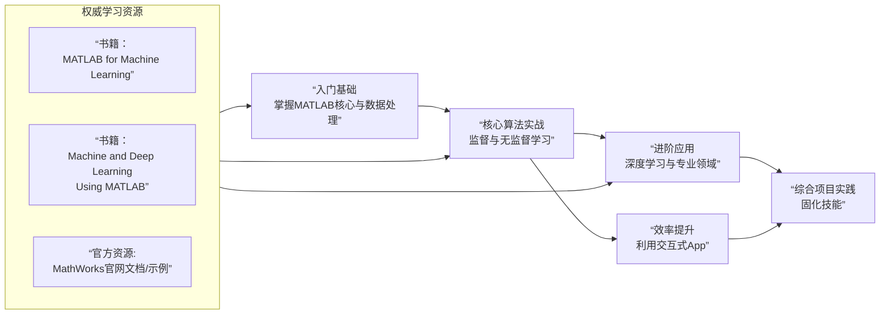

+++
title = 'MATLAB 实践机器学习'
date = 2026-02-02T16:48:39+08:00
draft = false
author = "simons"
categories = ["暂无"]
tags = ["暂无"]
description = "糟糕，写文章的时候忘记添加描述了！！！"
cover = "https://logos-marcas.com/wp-content/uploads/2020/12/MATLAB-Emblema.png"
+++

## 🧠 MATLAB 机器学习（ML）简明教程

从通用编程到机器学习，你需要关注的核心变化是 **从“如何计算”转向“如何让机器从数据中学习”**。在MATLAB中，这得益于其强大的工具箱和矩阵运算能力，使得实现机器学习算法变得直观高效。

本教程将带你了解MATLAB进行机器学习的关键路径和核心操作。

### 一、 🛠️ 核心工具箱与准备工作

进行机器学习前，你首先需要了解和准备相应的工具箱。

*   **必需工具箱**：主要依赖 **Statistics and Machine Learning Toolbox** 和 **Deep Learning Toolbox**。请使用 `ver` 命令检查是否已安装。
*   **学习模式**：机器学习主要分为 **监督学习**（有标签，如分类、回归）和 **无监督学习**（无标签，如聚类）。

### 二、 📊 数据处理与特征工程

数据是机器学习的基础，处理流程至关重要。

1.  **数据导入与探索**
    ```matlab
    % 从CSV文件读取数据到表格
    data = readtable('your_dataset.csv');
    % 查看前几行和摘要信息
    head(data)
    summary(data)
    ```

2.  **数据清洗与预处理**
    ```matlab
    % 处理缺失值：删除包含NaN的行
    data = rmmissing(data);
    % 或将缺失值替换为该列均值
    data.Variable1(isnan(data.Variable1)) = mean(data.Variable1, 'omitnan');

    % 数据规范化（将特征缩放到[0,1]区间）
    data_normalized = normalize(data, 'range');
    ```

3.  **特征选择与降维**
    ```matlab
    % 使用主成分分析（PCA）进行降维
    [coeff, score, latent] = pca(data_normalized);
    % latent 显示各主成分解释的方差，可用于决定保留多少维度
    explained_variance = cumsum(latent)./sum(latent);
    % 假设我们保留解释95%方差的主成分
    num_components = find(explained_variance >= 0.95, 1);
    data_pca = score(:, 1:num_components);
    ```

### 三、 🤖 监督学习实战：分类与回归

监督学习的目标是利用带标签的数据训练模型，以预测新数据的标签或值。

1.  **分类（Classification）**
    ```matlab
    % 划分训练集和测试集（70%训练，30%测试）
    cv = cvpartition(data.Label, 'HoldOut', 0.3);
    idx_train = training(cv);
    idx_test = test(cv);

    % 使用支持向量机（SVM）进行分类
    % 假设 features 是特征矩阵，labels 是类别标签
    SVMModel = fitcsvm(features(idx_train, :), labels(idx_train), ...
                       'KernelFunction', 'rbf', 'Standardize', true);

    % 在测试集上预测并评估
    predicted_labels = predict(SVMModel, features(idx_test, :));
    accuracy = sum(predicted_labels == labels(idx_test)) / numel(labels(idx_test));
    fprintf('分类准确率：%.2f%%\n', accuracy*100);

    % 也可以使用集成学习如随机森林提升性能
    % EnsembleModel = fitcensemble(features(idx_train, :), labels(idx_train), 'Method', 'Bag');
    ```

2.  **回归（Regression）**
    ```matlab
    % 使用线性回归拟合连续值目标变量
    % 假设 X 是特征，y 是连续目标值（如房价）
    linear_model = fitlm(X_train, y_train);

    % 查看模型摘要（包括R²、系数显著性等）
    disp(linear_model)

    % 预测
    y_pred = predict(linear_model, X_test);

    % 计算均方根误差（RMSE）评估
    rmse = sqrt(mean((y_test - y_pred).^2));
    fprintf('回归模型RMSE：%.4f\n', rmse);
    ```

### 四、 🔍 无监督学习实战：聚类

无监督学习用于发现数据内在的结构或分组。

```matlab
% 使用k-means聚类对无标签数据进行分组
% 假设已将数据 features 降维或预处理
k = 3; % 假设我们期望分为3类
[idx, centroids] = kmeans(features, k);

% 可视化聚类结果（如果特征是2维或经PCA降至2维）
gscatter(features(:,1), features(:,2), idx);
hold on;
plot(centroids(:,1), centroids(:,2), 'kx', 'MarkerSize', 15, 'LineWidth', 3);
title('K-means聚类结果');
legend('Cluster 1', 'Cluster 2', 'Cluster 3', 'Centroids');
hold off;
```

### 五、 🧠 深度学习入门

对于更复杂的模式识别（如图像、文本），可以借助深度学习。

1.  **构建一个简单的多层感知机（MLP）**
    ```matlab
    % 假设已准备好训练数据 X_train, y_train（分类标签需为分类数组）
    layers = [
        featureInputLayer(size(X_train, 2)) % 输入层，维度自动匹配特征数
        fullyConnectedLayer(64)             % 全连接层，64个神经元
        reluLayer()                         % 激活函数层
        fullyConnectedLayer(32)
        reluLayer()
        fullyConnectedLayer(numel(unique(y_train))) % 输出层神经元数等于类别数
        softmaxLayer()                       % 用于多分类
        classificationLayer()];              % 分类输出层

    options = trainingOptions('adam', ...    % 使用Adam优化器
        'MaxEpochs', 50, ...               % 最大训练轮数
        'ValidationData', {X_val, y_val}, ... % 验证集（可选）
        'Plots', 'training-progress');     % 显示训练进度图

    net = trainNetwork(X_train, y_train, layers, options);
    ```

2.  **使用预训练网络进行图像分类（迁移学习）**
    ```matlab
    % 加载预训练的GoogLeNet模型
    net = googlenet; % 需Deep Learning Toolbox Model for GoogLeNet支持

    % 替换最后的分类层以适应你的分类数
    lgraph = layerGraph(net);
    num_classes = 5; % 你的数据类别数
    new_fc = fullyConnectedLayer(num_classes, 'Name', 'new_fc');
    new_output = classificationLayer('Name', 'new_classoutput');
    lgraph = replaceLayer(lgraph, 'loss3-classifier', new_fc);
    lgraph = replaceLayer(lgraph, 'output', new_output);

    % 准备图像数据
    imds = imageDatastore('path_to_images', ...
        'IncludeSubfolders', true, 'LabelSource', 'foldernames');
    [imdsTrain, imdsVal] = splitEachLabel(imds, 0.7, 'randomized'); % 70%训练

    % 调整图像大小以匹配网络输入
    input_size = net.Layers(1).InputSize;
    augimdsTrain = augmentedImageDatastore(input_size(1:2), imdsTrain);
    augimdsVal = augmentedImageDatastore(input_size(1:2), imdsVal);

    % 训练选项与训练
    options = trainingOptions('sgdm', ...
        'InitialLearnRate', 0.0001, ...
        'MaxEpochs', 10, ...
        'ValidationData', augimdsVal, ...
        'Plots', 'training-progress');
    net_transfer = trainNetwork(augimdsTrain, lgraph, options);
    ```

### 六、 📈 模型评估与选择

模型训练后，必须进行系统评估。

*   **分类评估**：混淆矩阵 (`confusionchart`)、准确率、精确率、召回率、F1分数。
*   **回归评估**：均方误差（MSE）、均方根误差（RMSE）、R²决定系数。
*   **防止过拟合**：使用**交叉验证**。
    ```matlab
    % 创建5折交叉验证分区
    cv = cvpartition(labels, 'KFold', 5);
    cv_accuracy = zeros(cv.NumTestSets, 1);

    for i = 1:cv.NumTestSets
        idx_train = training(cv, i);
        idx_test = test(cv, i);
        model = fitcsvm(features(idx_train, :), labels(idx_train));
        pred = predict(model, features(idx_test, :));
        cv_accuracy(i) = sum(pred == labels(idx_test)) / numel(labels(idx_test));
    end
    fprintf('交叉验证平均准确率：%.2f%%\n', mean(cv_accuracy)*100);
    ```

### 七、 📚 学习路径与资源推荐

为了帮助你系统地学习，我梳理了以下学习路径和关键资源：



*   **交互式工具**：善用MATLAB的 **Classification Learner** 和 **Regression Learner** App，它们提供图形化界面，能快速尝试和比较多种算法，非常适合初学者探索。
*   **进阶与部署**：随着技能提升，你可以探索更复杂的领域，如**时间序列分析**、**强化学习**（通过Reinforcement Learning Toolbox）以及将训练好的模型部署到嵌入式设备或生成C/C++代码。

希望这篇教程能成为你使用MATLAB探索机器学习世界的良好开端。如果你能告诉我你具体的研究方向或希望解决哪一类问题（例如，是处理图像数据、信号数据，还是进行数值预测），我可以提供更具针对性的学习建议或示例。
